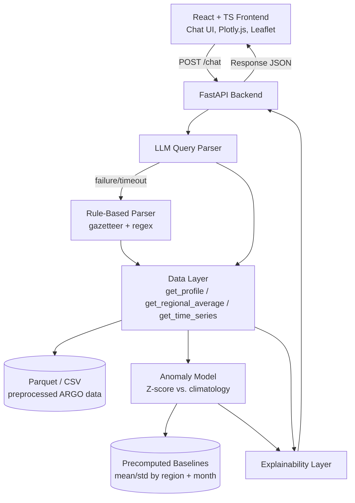
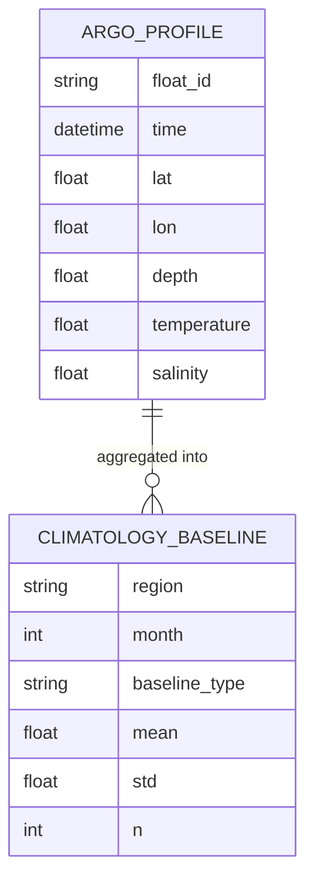

# FloatChat-Lite — Architecture

> **Status:** Draft | **Last updated:** 13 August 2026

## 1. System Overview
FloatChat-Lite is a stateless, request/response conversational system: a React frontend sends a natural-language query to a FastAPI backend, which parses it (LLM-first, rule-based fallback), retrieves matching ARGO ocean data from preprocessed Parquet/CSV files, scores it against a precomputed climatology baseline for anomalies, and wraps the result in a plain-language explanation before returning a single structured JSON response. There is no database, no user accounts, and no multi-turn memory — every query is self-contained, which keeps the 48-hour build simple and removes state-management failure modes. The system fits into the broader SIH26 "explainable ocean intelligence" problem space (PS1 conversational access + PS2 anomaly detection + PS3 explainability) as a single unified pipeline rather than three separate tools.

## 2. Architecture Diagram



## 3. Tech Stack

| Layer | Technology | Rationale |
|---|---|---|
| Frontend | React + TypeScript, Plotly.js (charts), Leaflet (maps) | Fast to build a chat UI with interactive charts/maps; both libraries are well-documented and demo-reliable |
| Backend / API | Python 3.10+, FastAPI | Async-friendly, minimal boilerplate, fast to stand up endpoints in a hackathon timeframe |
| Query Parsing | Direct LLM API calls (GPT-4o-mini / Claude 3.5 / Ollama Llama 3.1) — no LangChain | Direct calls mean fewer abstraction layers and failure modes than a framework; easier to debug live |
| Data Processing | pandas, numpy, xarray | Standard scientific Python stack for converting NetCDF ARGO data into query-able tables |
| Anomaly Model | scikit-learn (Z-score helpers), no Isolation Forest | Z-score vs. climatology is simple to implement, explain to judges, and validate in 2 days |
| Data Storage | CSV/Parquet files (preprocessed from NetCDF), no MongoDB | Zero-config, fast, nothing to break on demo day; the dataset is small and read-heavy, not written to live |
| Deployment | Hugging Face Spaces | Proven path used successfully by SIH25040 (2025) teams |
| Auth | None | Out of scope — single-user demo tool, no accounts or persistence of user data |

## 4. Component Breakdown

### 4.1 React Frontend (Chat UI)
- **Responsibility:** Collects the user's natural-language query, sends it to `POST /chat`, and renders the response — query summary header, Plotly chart, Leaflet map pin, `AnomalyBadge` component, explanation footer, and data-sufficiency line. Also renders the degraded-mode disclosure line when `parser_used == "rule_based"`.
- **Interfaces:** Calls `POST /chat` on the FastAPI backend; consumes the full Response JSON contract (Section 6).
- **Depends on:** FastAPI Backend; Plotly.js and Leaflet as rendering libraries.

### 4.2 FastAPI Backend
- **Responsibility:** Orchestrates the full request lifecycle — receives the query, invokes the parser (with fallback), calls the Data Layer, invokes the Anomaly Model when relevant, assembles the Explainability Layer output, and returns the final JSON. Also converts internal failures into the three friendly error types (`no_data`, `parse_error`, `general_error`).
- **Interfaces:** Exposes `POST /chat` to the frontend; internally calls the LLM Query Parser, Data Layer, Anomaly Model, and Explainability Layer.
- **Depends on:** LLM API provider, Data Layer, Anomaly Model, Explainability Layer.

### 4.3 LLM Query Parser
- **Responsibility:** Converts free-text queries into structured parameters (`query_type`, `lat`, `lon`, `parameter`, `date_from`, `date_to`, `include_anomaly`) via a direct LLM API call using the prompt in PRD Appendix A equivalent. Tags its own output `parser_used: "llm"`.
- **Interfaces:** Called by the FastAPI Backend; calls out to the external LLM API (GPT-4o-mini / Claude 3.5 / Ollama).
- **Depends on:** External LLM API availability and latency; falls through to the Rule-Based Parser on failure or timeout.

### 4.4 Rule-Based Parser (Fallback)
- **Responsibility:** Deterministically parses queries using a small city gazetteer (Mumbai, Chennai, Kolkata, Kochi, Visakhapatnam, Goa), lat/lon regex, year-range regex, and keyword matching for query type and parameter. Always tags output `parser_used: "rule_based"`.
- **Interfaces:** Invoked by the FastAPI Backend only when the LLM Query Parser fails or times out.
- **Depends on:** Nothing external — pure Python, no network calls, by design (it exists to be the reliable fallback).

### 4.5 Data Layer
- **Responsibility:** Reads preprocessed ARGO Parquet/CSV data and exposes `get_profile()`, `get_regional_average()`, and `get_time_series()` functions that return chart-ready data plus `data_sufficiency` (`profile_count`, `coverage_radius_km`, `confidence`).
- **Interfaces:** Called by the FastAPI Backend with structured query parameters; reads from the Parquet/CSV data store.
- **Depends on:** Preprocessed ARGO dataset (NetCDF → Parquet/CSV pipeline, run ahead of the live demo).

### 4.6 Anomaly Model
- **Responsibility:** Computes a Z-score for the queried value against a precomputed production baseline (mean/std by region and month, full available history) and classifies it as `normal`, `mild_positive`, `mild_negative`, `strong_positive`, or `strong_negative`.
- **Interfaces:** Called by the FastAPI Backend when `include_anomaly` is true or the query implies anomaly interest; reads precomputed baselines.
- **Depends on:** Precomputed Production Baselines (distinct from the separate Validation Baseline used only in `validate_heatwave.py`).

### 4.7 Explainability Layer
- **Responsibility:** Converts Data Layer and Anomaly Model outputs into plain-language text — `answer_explanation` (data source, aggregation method, proxy assumptions like the ≤10m SST depth cutoff) and the anomaly's plain-language "why."
- **Interfaces:** Called by the FastAPI Backend after data retrieval and (optionally) anomaly scoring, before the response is returned.
- **Depends on:** Output of the Data Layer and Anomaly Model.

### 4.8 AnomalyBadge (Frontend Component)
- **Responsibility:** Renders the anomaly severity badge with color coding, but suppresses the colored badge and shows a neutral "not enough data to assess" state whenever `data_sufficiency.confidence` is `"low"`.
- **Interfaces:** Receives `anomaly` and `dataSufficiency` props from the Chat UI.
- **Depends on:** Response JSON fields `anomaly` and `data_sufficiency`.

## 5. Data Model

FloatChat-Lite has no persistent application database — its "data model" is the ARGO dataset schema plus the precomputed baseline table used for anomaly scoring.

**ARGO Profile Record** (one row per depth measurement, stored in Parquet/CSV):

| Field | Type | Description |
|---|---|---|
| float_id | string | ARGO float identifier |
| time | datetime | Profile timestamp |
| lat | float | Latitude (degrees) |
| lon | float | Longitude (degrees) |
| depth | float | Depth (meters, 0–2000m) |
| temperature | float | Temperature (°C) |
| salinity | float | Salinity (PSU) |

**Climatology Baseline Record** (precomputed, one row per region × month):

| Field | Type | Description |
|---|---|---|
| region | string | Named region (e.g., `arabian_sea_mumbai`, `bay_of_bengal`) |
| month | int | Calendar month (1–12) |
| baseline_type | string | `"production"` (full history) or `"validation"` (2015–2018 only) |
| mean | float | Mean temperature for this region/month/baseline_type |
| std | float | Standard deviation for this region/month/baseline_type |
| n | int | Number of profiles the baseline was computed from |



## 6. API Design

| Method | Endpoint | Purpose | Auth required |
|---|---|---|---|
| POST | /chat | Accepts a natural-language query, returns summary, chart data, optional anomaly, explanation, and data-sufficiency info | No |

**Request:**
```json
{
  "query": "Plot SST time series at 19N, 72.8E for 2015-2024 and tell me if it's unusual"
}
```

**Response (200):**
```json
{
  "summary": "Here is the SST time series near 19.0N, 72.8E for 2015-2024 based on ARGO float data.",
  "query_type": "time_series",
  "params": { "lat": 19.0, "lon": 72.8, "parameter": "sst", "date_from": "2015-01-01", "date_to": "2024-12-31" },
  "data": { "time": ["2015-01", "..."], "value": [28.1, "..."] },
  "anomaly": {
    "score": 1.8,
    "label": "mild_positive",
    "baseline": { "period": "2015-01 to 2023-12", "mean": 28.4, "std": 0.67 },
    "explanation": "Recent SST is about 1.2C above the 10-year mean for this region, 1.8 standard deviations higher than usual."
  },
  "answer_explanation": "Values are monthly averages of all ARGO profiles within ~50km of 19N, 72.8E. SST is a shallowest-measurement proxy (<=10m), not satellite SST. Source: INCOIS ARGO subset (2015-2024).",
  "data_sufficiency": { "profile_count": 15, "coverage_radius_km": 50, "confidence": "high" },
  "parser_used": "llm",
  "source": "INCOIS ARGO"
}
```

**Error responses (200 with error body, or 4xx — implementation detail TBD):**
- `no_data` — no ARGO profiles found for the requested region/time window
- `parse_error` — the query couldn't be understood by either parser
- `general_error` — unexpected failure; never expose a raw stack trace to the client

## 7. Infrastructure & Deployment
- **Hosting:** Hugging Face Spaces, following the SIH25040 (2025) precedent — a single Space serving both the FastAPI backend and the built React frontend (or two Spaces if split is simpler for the team).
- **Environments:** Single environment for the hackathon (no separate dev/staging/prod) — local development against the same preprocessed Parquet/CSV files that ship to the demo Space.
- **CI/CD:** None formalized for the hackathon; deployment is a manual push to the Hugging Face Space, verified against the three pinned demo queries before presentation.
- **Data pipeline:** One-time offline preprocessing step (NetCDF → Parquet/CSV, baseline precomputation) run before the live demo — never repeated live, to avoid latency and failure risk.
- **Fallback path:** If real ARGO ingestion isn't query-ready by Day 1, hour 4, the pipeline swaps in a small pre-vetted fallback subset (1–2 regions, 2 years), clearly labeled internally as non-validated.

## 8. Security Considerations
- No user accounts, no authentication, no PII collected — the system only handles public ARGO oceanographic data and stateless queries.
- LLM API keys are held server-side only (FastAPI backend), never exposed to the frontend.
- All external-facing error messages are sanitized (`no_data` / `parse_error` / `general_error`); no stack traces or internal paths are ever returned to the client.
- Input to the LLM parser is a single free-text field — no query is executed as code or used to construct raw file-system paths, limiting injection surface.

## 9. Scalability & Performance
- **Expected load:** Single-demo / hackathon-judge scale — not designed for concurrent production traffic.
- **Bottleneck:** The LLM Query Parser call is the primary latency source; the rule-based fallback exists partly as a resilience mechanism and partly to bound worst-case latency.
- **Caching/precomputation:** Anomaly baselines (mean/std by region/month) are precomputed once offline, not recalculated per request — this is the main performance lever, removing any live heavy aggregation from the request path.
- **Scaling plan:** Out of scope for the hackathon; Phase 4 (post-hackathon, per the PRD) is where production deployment and INCOIS/VEDAS integration would need real scaling work.

## 10. Key Technical Decisions & Tradeoffs

| Decision | Alternatives considered | Why this choice |
|---|---|---|
| Direct LLM API calls, no LangChain | LangChain / other orchestration frameworks | Less abstraction, fewer failure modes, easier to debug under time pressure |
| CSV/Parquet files, no MongoDB | MongoDB or another database | Zero-config, faster to build, nothing extra to break on demo day |
| Z-score vs. climatology, no Isolation Forest | Isolation Forest / other ML anomaly detectors | Proven sufficient for ocean anomaly detection, explainable to judges, feasible in 2 days |
| Stateless queries, no multi-turn memory | Session-based conversational memory | Removes state-management bugs while still satisfying the "chat interface" requirement |
| Precomputed baselines (offline) | Live baseline computation per request | Removes live-latency risk; one-time cost during data prep instead |
| Separate validation (2015–2018) vs. production (full history) baselines | Single shared baseline for both validation and live queries | Prevents conflating a short test window with the real serving baseline — data integrity concern surfaced in the redteam pass |
| Rule-based fallback parser, always tagged and disclosed in UI | Silent failure or generic error when LLM parsing fails | Keeps the "explainable/trustworthy" framing honest even in a degraded mode |

## 11. Open Technical Questions
- [ ] Will the FastAPI backend and React frontend be deployed as one combined Hugging Face Space or two separate Spaces?
- [ ] What HTTP status codes will `no_data` / `parse_error` / `general_error` actually return (200 with an error body vs. 4xx)?
- [ ] Which LLM provider is finalized for the live demo, and has API rate-limit/latency behavior been tested under demo conditions?
- [ ] How many years of history will the production baseline actually use once the real preprocessed dataset size is known (target 8–9 years)?
- [ ] If the fallback ARGO subset is triggered, does it cover the exact regions/coordinates used in the three pinned demo queries?
## 12. Outcome

FloatChat-Lite has one browser application and one FastAPI process. Scientific data preparation happens offline; live requests only validate, parse, filter prepared artifacts, compute bounded statistics, and compose an explanation.

```text
Browser (frontend/)
  -> POST /chat
FastAPI route
  -> validated parser result (LLM or deterministic fallback)
  -> data repository (versioned Parquet)
  -> anomaly policy (versioned production baseline)
  -> explanation templates
  -> validated response
Browser renders summary, chart, map, confidence, method, and disclosure
```

## 13. Component boundaries

- `frontend/` owns input state, loading/error/success presentation, charts, map context, and accessibility. It does not parse queries or calculate scientific results.
- `backend/app/api/` owns HTTP validation, orchestration, status codes, and safe typed errors. It does not preprocess data.
- `backend/app/services/parser.py` owns the deterministic supported grammar. A future LLM adapter must produce the same validated `QueryParams` and fall back here.
- `backend/app/services/data.py` owns manifest readiness and prepared-data access. It must not invent fallback values.
- `backend/app/services/anomaly.py` owns z-score policy and confidence suppression. It does not choose visual colors.
- `scripts/` owns offline NetCDF preprocessing, baseline creation, validation, and parser evaluation.
- `data/` owns versioned artifacts and provenance. Production and validation baselines never mix.

## Deployment

`deploy/Dockerfile` builds the existing frontend, installs the API with scientific dependencies, and serves both from one Python container. The runtime receives data as files and secrets through environment settings. There is no database, queue, or separate frontend deployment in the core build.

## Current gap

The structure and API safety foundation exist, but the scientific repository intentionally refuses success until the team implements and validates the ARGO preprocessing/repository path. This is a visible checkpoint, not a hidden mock.