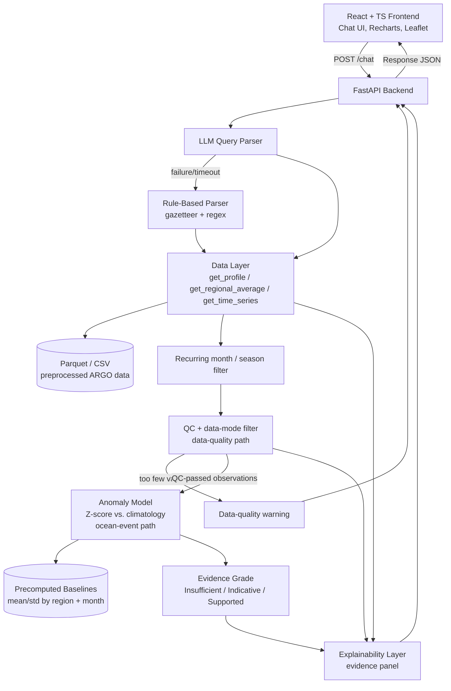
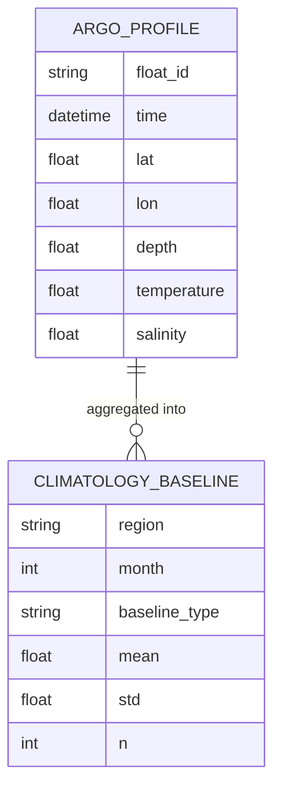

# FloatChat-Lite — Architecture

> **Status:** Implemented engineering architecture | **Last updated:** 24 August 2026 (rev. C — compound temporal parsing and response transparency)

## 1. System Overview
FloatChat-Lite is a stateless, request/response conversational system: a React frontend sends a natural-language query to a FastAPI backend, which parses it (LLM-first, rule-based fallback), retrieves matching ARGO ocean data from preprocessed Parquet/CSV files, **filters it against ARGO quality-control flags**, scores the QC-passed data against a precomputed climatology baseline for anomalies, grades the result's trustworthiness, and wraps it in a computation-transparency panel before returning a single structured JSON response. There is no database, no user accounts, and no multi-turn memory — every query is self-contained, which keeps the 48-hour build simple and removes state-management failure modes. The system fits into the broader SIH26 "explainable ocean intelligence" problem space (PS1 conversational access + PS2 anomaly detection + PS3 explainability) as a single unified pipeline rather than three separate tools.

The system is deliberately built around **two separate paths after data retrieval**: a **data-quality path** (QC filtering — is this observation trustworthy at all?) and an **ocean-event path** (anomaly scoring — given trustworthy observations, is the value unusual?). Collapsing these into one step was the core issue flagged in review: a strange temperature reading can be a sensor or profile error rather than a real oceanographic event, and ARGO's own QC flags and delayed-mode data exist specifically to make that distinction. Keeping the paths separate means a bad sensor reading can never masquerade as a detected anomaly.

Rev. C adds a distinct recurring-period filter between retrieval and QC, hybrid
parser authority rules, actual float positions, structured no-data diagnostics, and
frontend explanations driven by returned calculation metadata. These additions do
not change the source boundary: only installed ARGO observations can produce values.

## 2. Architecture Diagram



## 3. Tech Stack

| Layer | Technology | Rationale |
|---|---|---|
| Frontend | React + TypeScript, Recharts (charts), Leaflet (maps) | Typed interactive charts and maps with the established application component system |
| Backend / API | Python 3.10+, FastAPI | Async-friendly, minimal boilerplate, fast to stand up endpoints in a hackathon timeframe |
| Query Parsing | Direct structured-output provider call (Gemini by default; documented compatible providers) plus deterministic policy/fallback — no LangChain | The provider may interpret dates and intent, while deterministic geography, safety, schema validation, and fallback keep the result bounded and reproducible |
| Data Processing | pandas, NumPy | Standard scientific Python stack for validating INCOIS CSV exports and producing query-able tables |
| Anomaly Model | NumPy Z-score calculation, no Isolation Forest | Z-score vs. climatology is simple to implement, explain to judges, and validate in 2 days |
| Data Storage | CSV/Parquet files (preprocessed from reviewed INCOIS CSV exports), no MongoDB | Zero-config, fast, nothing to break on demo day; the dataset is small and read-heavy, not written to live |
| Deployment | Hugging Face Spaces | Proven path used successfully by SIH25040 (2025) teams |
| Auth | None | Out of scope — single-user demo tool, no accounts or persistence of user data |

## 4. Component Breakdown

### 4.1 React Frontend (Chat UI)
- **Responsibility:** Collects the user's natural-language query, sends it to `POST /chat`, and renders interpreted metadata, all chart variants, a query anchor and actual contributing float positions, anomaly formula and inputs, evidence checks, QC exclusions, selected baseline, and provenance. Every scientific chart has a collapsible four-part explanation, and technical terms open a plain-language glossary. It also renders structured error diagnostics and the degraded-mode disclosure when `parser_used == "rule_based"`.
- **Interfaces:** Calls `POST /chat` on the FastAPI backend; consumes the full Response JSON contract (Section 6).
- **Depends on:** FastAPI Backend; Recharts and Leaflet as rendering libraries.

### 4.2 FastAPI Backend
- **Responsibility:** Orchestrates the full request lifecycle — receives the query, invokes the parser (with fallback), calls the Data Layer, invokes the Anomaly Model when relevant, assembles the Explainability Layer output, and returns the final JSON. Also converts internal failures into the three friendly error types (`no_data`, `parse_error`, `general_error`).
- **Interfaces:** Exposes `POST /chat` to the frontend; internally calls the LLM Query Parser, Data Layer, Anomaly Model, and Explainability Layer.
- **Depends on:** LLM API provider, Data Layer, Anomaly Model, Explainability Layer.

### 4.3 LLM Query Parser
- **Responsibility:** May propose exact-schema structured parameters from free text. The provider is authoritative for supported intent and temporal interpretation when it supplies them. Deterministic policy remains authoritative for the canonical place/coordinates, radius, supported parameters, geography/safety boundary, and schema. Provider failure or an invalid plan falls back without breaking the request.
- **Interfaces:** Called by the FastAPI Backend; calls the configured structured-output provider with one server-side key.
- **Depends on:** External LLM API availability and latency; falls through to the Rule-Based Parser on failure or timeout.

### 4.4 Rule-Based Parser (Fallback)
- **Responsibility:** Deterministically parses queries using a 100-plus-alias canonical Indian Ocean gazetteer shared with the provider prompt, hemispheric coordinates and radii, year/month/range/relative/season combinations, casual parameter and intent phrases, and boundary-aware matching. An explicit place or coordinate takes priority over a broad ocean name. It preserves coordinate precision, supports multi-parameter questions, and rejects unsupported, injected, or out-of-policy values. Always tags output `parser_used: "rule_based"`.
- **Interfaces:** Invoked directly when no provider is configured and as the mandatory fallback when the LLM times out, fails, or returns invalid output.
- **Depends on:** Nothing external — pure Python, no network calls, by design (it exists to be the reliable fallback).

### 4.5 Data Layer
- **Responsibility:** Reads preprocessed ARGO Parquet/CSV data, retrieves matching point-radius or named-region/time/parameter records, and applies any recurring `calendar_month` or named `season` selection before QC. It does **not** decide trustworthiness — that is the QC Filter's job.
- **Interfaces:** Called by the FastAPI Backend with structured query parameters; reads from the Parquet/CSV data store.
- **Depends on:** Preprocessed ARGO dataset (INCOIS CSV → Parquet/CSV pipeline, run ahead of the live demo), including the retained parameter QC fields per record (Section 5).

### 4.6 QC Filter (Data-Quality Path)
- **Responsibility:** Excludes records whose ARGO quality-control flag marks them as bad, and prefers adjusted/delayed-mode values over raw real-time values for historical (non-live) analysis. Outputs the QC-passed record set plus `valid_profile_count` and `distinct_float_count`. If too few valid observations remain after filtering, sets a `data_quality_warning` flag rather than silently passing thin data downstream.
- **Interfaces:** Called by the FastAPI Backend immediately after the Data Layer returns raw records, before the Anomaly Model runs.
- **Depends on:** ARGO QC flag and adjusted/delayed-mode fields in the preprocessed dataset (Section 5).
- **Rationale:** This is the project's core scientific-integrity decision — a strange temperature value can be a sensor or profile artifact rather than a real event, and ARGO's QC/delayed-mode system exists specifically to communicate measurement quality. Every value reaching the Anomaly Model has already passed this check; the Anomaly Model itself never sees or reasons about raw, unfiltered data.

### 4.7 Anomaly Model (Ocean-Event Path)
- **Responsibility:** Computes a Z-score (`z = (x − μ) / σ`) for the QC-passed queried value against a precomputed production baseline (mean/std by region and month, full available history) and classifies it as `normal`, `mild_positive`, `mild_negative`, `strong_positive`, or `strong_negative`. Also passes through the baseline's `n` (sample size) and the QC Filter's `valid_profile_count` / `distinct_float_count` so the Evidence Grade can be computed. Does not itself use the terms "marine heatwave" — that requires daily SST above a seasonally varying percentile threshold for a sustained duration (a different method than sparse-profile Z-scoring), so results are labeled "upper-ocean temperature anomaly" or "salinity anomaly" instead.
- **Interfaces:** Called by the FastAPI Backend for every successful parameter result; it emits a score only when the evidence grade, baseline sample, and non-zero baseline standard deviation permit one. `include_anomaly` changes narrative emphasis rather than bypassing those gates.
- **Depends on:** QC Filter output; Precomputed Production Baselines (distinct from the separate Validation Baseline used only in `validate_heatwave.py`).

### 4.8 Evidence Grade
- **Responsibility:** Replaces the old `low/medium/high` confidence tier (which was profile-count only) with a defined three-tier grade computed from multiple independent signals, not one number:
  - **Insufficient** — fewer than 5 valid current profiles, or too few baseline observations (`n` below the region/month's minimum).
  - **Indicative** — enough observations to compute a score, but spatial coverage is limited (e.g., too few distinct floats, or observations clustered rather than spread across the query radius).
  - **Supported** — sufficient valid profiles, sufficient baseline sample size, multiple distinct float IDs, and acceptable QC pass rate, all simultaneously.
- **Interfaces:** Called by the FastAPI Backend after the Anomaly Model runs; reads `valid_profile_count`, `distinct_float_count`, baseline `n`, and QC pass rate.
- **Depends on:** QC Filter and Anomaly Model outputs.
- **Rationale:** A single confidence score (or a bare profile-count threshold) hides *why* a result is or isn't trustworthy. Requiring multiple conditions to hold simultaneously forces the system to justify "Supported" rather than assert it.

### 4.9 Explainability Layer (Evidence Panel)
- **Responsibility:** Assembles a real, expandable **"Why this result?" evidence panel** containing the actual computed values and provenance — e.g., "14 QC=1 adjusted profiles from four floats; July 2024 mean: 28.9°C; July 2015–2023 baseline: 28.1 ± 0.4°C; z = +2.0" — plus `answer_explanation` (data source, aggregation method, proxy assumptions like the ≤10m SST depth cutoff). This is described in all docs/pitch material as **computation transparency and provenance reporting**, not SHAP/LIME-style explainable AI, since no model-attribution technique is used.
- **Interfaces:** Called by the FastAPI Backend after data retrieval, QC filtering, and (optionally) anomaly scoring/grading, before the response is returned.
- **Depends on:** Output of the Data Layer, QC Filter, Anomaly Model, and Evidence Grade.
- **Rev. C detail:** The panel returns raw/valid/excluded profile and observation
  counts, exclusion reasons, float count and positions, actual aggregation and
  per-bin counts, selected baseline grid/region/month, Z-score inputs,
  threshold-by-threshold evidence checks, artifact hash, and bounded source-record
  traces. The frontend renders these values rather than generic placeholder copy.

### 4.10 AnomalyBadge (Frontend Component)
- **Responsibility:** Renders the anomaly severity badge with color coding, but suppresses the colored badge and shows a neutral "not enough data to assess" state whenever `evidence_grade` is `"Insufficient"`, and shows a "provisional" qualifier when `"Indicative"`. Full-weight color only renders on `"Supported"`.
- **Interfaces:** Receives `anomaly` and `evidence_grade` props from the Chat UI.
- **Depends on:** Response JSON fields `anomaly` and `evidence_grade`.

## 5. Data Model

FloatChat-Lite has no persistent application database — its "data model" is the ARGO dataset schema plus the precomputed baseline table used for anomaly scoring.

**ARGO Profile Record** (one row per depth measurement, stored in Parquet/CSV):

| Field | Type | Description |
|---|---|---|
| float_id | string | ARGO float identifier |
| time | datetime | Profile timestamp |
| lat | float | Latitude (degrees) |
| lon | float | Longitude (degrees) |
| depth | float | Depth (meters, 0–2000m) |
| temperature | float | Temperature (°C) |
| salinity | float | Salinity (PSU) |
| qc_flag | int | ARGO quality-control flag for this observation (used by the QC Filter to exclude bad records) |
| data_mode | string | `"R"` (real-time), `"A"` (adjusted), or `"D"` (delayed-mode) — delayed-mode/adjusted preferred for historical analysis |

**Climatology Baseline Record** (precomputed, one row per region × month):

| Field | Type | Description |
|---|---|---|
| region | string | Named region (e.g., `arabian_sea_mumbai`, `bay_of_bengal`) |
| month | int | Calendar month (1–12) |
| baseline_type | string | `"production"` (full history) or `"validation"` (2015–2018 only) |
| mean | float | Mean temperature for this region/month/baseline_type |
| std | float | Standard deviation for this region/month/baseline_type |
| n | int | Number of profiles the baseline was computed from |



## 6. API Design

| Method | Endpoint | Purpose | Auth required |
|---|---|---|---|
| POST | /chat | Accepts a natural-language query, returns summary, chart data, optional anomaly, explanation, and data-sufficiency info | No |

**Request:**
```json
{
  "query": "Plot SST time series at 19N, 72.8E for 2015-2024 and tell me if it's unusual"
}
```

**Response (200):**
```json
{
  "summary": "Here is the SST time series near 19.0N, 72.8E for 2015-2024 based on ARGO float data.",
  "query_type": "time_series",
  "params": { "lat": 19.0, "lon": 72.8, "parameter": "sst", "date_from": "2015-01-01", "date_to": "2024-12-31" },
  "data": { "time": ["2015-01", "..."], "value": [28.1, "..."] },
  "anomaly": {
    "score": 1.8,
    "label": "mild_positive",
    "baseline": { "period": "2015-01 to 2023-12", "mean": 28.4, "std": 0.67, "n": 108 },
    "explanation": "Recent SST is about 1.2C above the 10-year mean for this region, 1.8 standard deviations higher than usual."
  },
  "evidence_grade": "Supported",
  "evidence_panel": {
    "valid_profile_count": 14,
    "distinct_float_count": 4,
    "qc_rule": "QC=1, adjusted/delayed-mode preferred",
    "current_period_summary": "14 QC=1 adjusted profiles from 4 floats; July 2024 mean: 28.9C",
    "baseline_summary": "July 2015-2023 baseline: 28.1 +/- 0.4C (n=108)",
    "score_summary": "z = +2.0"
  },
  "data_quality_warning": false,
  "answer_explanation": "Values are monthly averages of all ARGO profiles within ~50km of 19N, 72.8E. SST is a shallowest-measurement proxy (<=10m), not satellite SST. Source: INCOIS ARGO subset (2015-2024).",
  "data_sufficiency": { "profile_count": 15, "coverage_radius_km": 50 },
  "parser_used": "llm",
  "source": "INCOIS ARGO"
}
```

> **Note on `evidence_grade` replacing `data_sufficiency.confidence`:** the old `confidence` field (`low`/`medium`/`high`, based on profile count alone) is retired in favor of `evidence_grade` (`Insufficient`/`Indicative`/`Supported`, based on profile count, baseline `n`, distinct float count, and QC pass rate together — see Section 4.8). `data_sufficiency` is kept for the raw counts the panel displays, but no longer carries the trust judgment itself.

**Error responses:**
- `404 no_data` — no ARGO profiles matched; includes the understood selection, searched area/time, zero count, nearest wider-search distance when available, and an alternative query
- `422 parse_error` — neither safe parser path could accept the question
- `503 general_error` — a required artifact is unavailable
- `500 general_error` — sanitized unexpected failure; never exposes a raw stack trace

## 7. Infrastructure & Deployment
- **Hosting:** Hugging Face Spaces, following the SIH25040 (2025) precedent — a single Space serving both the FastAPI backend and the built React frontend (or two Spaces if split is simpler for the team).
- **Environments:** Single environment for the hackathon (no separate dev/staging/prod) — local development against the same preprocessed Parquet/CSV files that ship to the demo Space.
- **CI/CD:** None formalized for the hackathon; deployment is a manual push to the Hugging Face Space, verified against the three pinned demo queries before presentation.
- **Data pipeline:** One-time offline preprocessing step (INCOIS CSV → Parquet/CSV, baseline precomputation) run before the live demo — never repeated live, to avoid latency and failure risk.
- **Fallback path:** If real ARGO ingestion isn't query-ready by Day 1, hour 4, the pipeline swaps in a small pre-vetted fallback subset (1–2 regions, 2 years), clearly labeled internally as non-validated.

## 8. Security Considerations
- No user accounts, no authentication, no PII collected — the system only handles public ARGO oceanographic data and stateless queries.
- LLM API keys are held server-side only (FastAPI backend), never exposed to the frontend.
- All external-facing error messages are sanitized (`no_data` / `parse_error` / `general_error`); no stack traces or internal paths are ever returned to the client.
- Input to the LLM parser is a single free-text field — no query is executed as code or used to construct raw file-system paths, limiting injection surface.

## 9. Scalability & Performance
- **Expected load:** Single-demo / hackathon-judge scale — not designed for concurrent production traffic.
- **Bottleneck:** The LLM Query Parser call is the primary latency source; the rule-based fallback exists partly as a resilience mechanism and partly to bound worst-case latency.
- **Caching/precomputation:** Anomaly baselines (mean/std by region/month) are precomputed once offline, not recalculated per request — this is the main performance lever, removing any live heavy aggregation from the request path.
- **Scaling plan:** Out of scope for the hackathon; Phase 4 (post-hackathon, per the PRD) is where production deployment and INCOIS/VEDAS integration would need real scaling work.

## 10. Key Technical Decisions & Tradeoffs

| Decision | Alternatives considered | Why this choice |
|---|---|---|
| Direct LLM API calls, no LangChain | LangChain / other orchestration frameworks | Less abstraction, fewer failure modes, easier to debug under time pressure |
| CSV/Parquet files, no MongoDB | MongoDB or another database | Zero-config, faster to build, nothing extra to break on demo day |
| Z-score vs. climatology, no Isolation Forest | Isolation Forest / other ML anomaly detectors | Transparent, feasible for the hackathon scope, and suitable for evaluation; scientific sufficiency remains gated on the frozen validation work |
| Stateless queries, no multi-turn memory | Session-based conversational memory | Removes state-management bugs while still satisfying the "chat interface" requirement |
| Precomputed baselines (offline) | Live baseline computation per request | Removes live-latency risk; one-time cost during data prep instead |
| Separate validation (2015–2018) vs. production (full history) baselines | Single shared baseline for both validation and live queries | Prevents conflating a short test window with the real serving baseline — data integrity concern surfaced in the redteam pass |
| Rule-based fallback parser, always tagged and disclosed in UI | Silent failure or generic error when LLM parsing fails | Keeps the "explainable/trustworthy" framing honest even in a degraded mode |
| Separate QC Filter stage before the Anomaly Model, rather than one combined "score everything" step | Score raw values directly, or discard low-QC data silently | A sensor/profile error can look identical to a real event in raw data; ARGO QC flags and delayed-mode data exist to make that distinction, and hiding excluded records would itself be a transparency failure — surfaced by the redteam pass |
| Three-condition Evidence Grade (Insufficient / Indicative / Supported) instead of a single confidence score | One numeric confidence score, or profile-count-only tiering (original design) | A single number collapses independent trust signals (sample size, baseline depth, spatial spread, QC pass rate) into one label and hides *why* a result is thin; requiring multiple conditions forces the system to justify "Supported" rather than assert it |
| "Upper-ocean temperature/salinity anomaly" instead of "marine heatwave" | Label any positive Z-score anomaly a heatwave | Formal marine-heatwave detection requires daily SST above a seasonally varying percentile threshold for a sustained duration; ARGO profiles are sparse in comparison, so using the formal term would overstate what the method actually measures |
| "Computation transparency / provenance reporting" instead of "explainable AI" | Market the evidence panel as XAI | No model-attribution technique (SHAP/LIME) is used — the panel surfaces real computed intermediate values, which is an honest and separately defensible claim |

## 11. Open Technical Questions
- [ ] Will the FastAPI backend and React frontend be deployed as one combined Hugging Face Space or two separate Spaces?
- [ ] Which LLM provider is finalized for the live demo, and has API rate-limit/latency behavior been tested under demo conditions?
- [ ] How many years of history will the production baseline actually use once the real preprocessed dataset size is known (target 8–9 years)?
- [ ] If the fallback ARGO subset is triggered, does it cover the exact regions/coordinates used in the three pinned demo queries?
