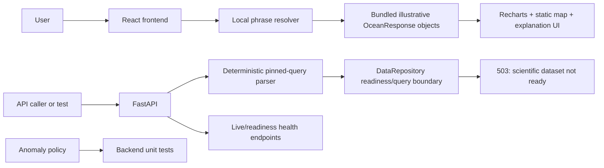
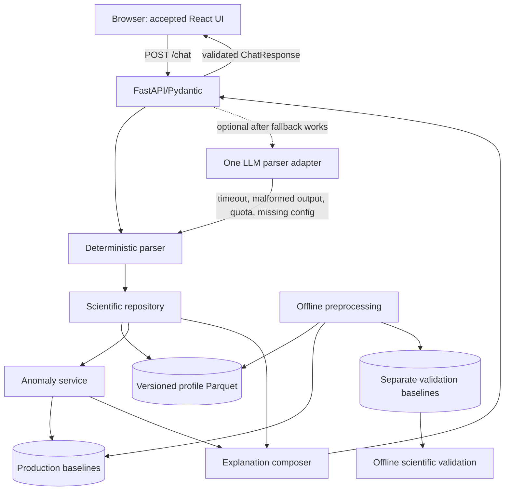

# FloatChat-Lite architecture

> Status: current architecture and planned completion path
> Verified against the repository on 21 August 2026

## 1. System overview

FloatChat-Lite currently has two deliberately separate experiences:

1. An accepted React/TypeScript/Vite frontend that resolves a narrow set of phrases against bundled **illustrative** `OceanResponse` objects and renders them with Recharts and a static Bhuvan map image.
2. A runnable FastAPI foundation that validates requests, parses the pinned grammar deterministically, exposes health endpoints, applies tested anomaly/confidence policy in isolation, and refuses to invent data when scientific artifacts are absent.

The intended end state is one stateless browser-to-API pipeline backed by offline-prepared, versioned ARGO artifacts. That integration is not implemented.

## 2. Current runtime

The frontend makes no network request to `/chat`. The backend has no success path because `DataRepository.query()` always raises `DataUnavailable`, even if a manifest is installed.

## 3. Target runtime after critical-path work

Dashed optional flow means the LLM adapter is planned, not present. Validation baselines never feed live responses.

## 4. Components and ownership

| Component | Current responsibility | Status | Boundary |
| --- | --- | --- | --- |
| `frontend/src/components/FloatChatApp.tsx` | Input, staged loading, local resolution, result/error/reset state | ✅ | Must not parse scientific queries or calculate real results after API integration. |
| `frontend/src/data/oceanResponses.ts` | Four illustrative flows and local phrase matching | ✅ illustrative only | Must never be relabelled as real data; replace runtime use only after contract freeze. |
| Recharts components | Depth, time-series/trend, and salinity visuals | ✅ | Plotly is not installed. |
| `OceanMap.tsx` | Static Bhuvan image with contextual marker/region overlay | ✅ | Leaflet and external map tiles are not used. |
| `backend/app/api/` | HTTP validation, orchestration boundary, safe errors, health | 🟡 | Does not preprocess data. Success/no-data mapping remains. |
| `backend/app/models.py` | Shared backend vocabulary and response/error models | 🟡 | Frontend types are currently different. |
| `backend/app/services/parser.py` | Deterministic grammar for four pinned patterns | ✅ narrow scope | No provider call and no general gazetteer/coordinate grammar. |
| `backend/app/services/data.py` | Manifest/file-existence readiness and refusal boundary | 🟡 | Actual Parquet reads, filters, aggregation, hashes, and schema validation are missing. |
| `backend/app/services/anomaly.py` | Confidence thresholds, z-score labels, severity suppression | ✅ isolated | Not connected to data or `/chat`. |
| `scripts/` | Offline scientific/evaluation entrypoints | 🟠 | Only requirements/readme and frontend-boundary check exist. |
| `data/` | Artifact layout and manifest schema | 🟡 structure only | No manifest or scientific artifact exists. |
| `deploy/` + `compose.yaml` | One-container build/runtime recipe | 🟡 unverified | No deployment or smoke evidence is recorded. |

## 5. Technology stack

| Layer | Current repository | Planned/conditional |
| --- | --- | --- |
| Frontend | React 19.2.6, TypeScript 5.9.3, Vite 8.0.13, Recharts 3.10.1, Lucide React, local Manrope/Space Grotesk fonts | No frontend library replacement is required. |
| API | Python ≥3.11, FastAPI, Pydantic, Uvicorn | One optional provider adapter behind the deterministic parser. Provider is undecided. |
| Scientific processing | Dependency groups for NumPy, pandas, PyArrow, xarray | Preprocessing/baseline/repository scripts are not implemented. |
| Storage | Directory/schema boundary for Parquet and baselines | Reviewed, versioned ARGO artifacts and manifest. No database server. |
| Testing | Node test runner, ESLint, pytest, Ruff, GitHub Actions | Real-data, contract-success, browser integration, container, provider-failure, and scientific validation evidence. |
| Deployment | Multi-stage Dockerfile and Compose recipe | Hosting platform is ⚪ needs verification; Hugging Face Spaces is an option, not a confirmed deployment. |

`scikit-learn`, Plotly.js, Leaflet, LangChain, authentication, databases, queues, and Kubernetes are not current dependencies.

## 6. Data and manifest boundaries

No scientific dataset is installed. The intended prepared profile fields are a design contract, not a verified file schema:

| Intended field | Meaning | Status |
| --- | --- | --- |
| `float_id` | Stable float identifier | 🟠 Planned |
| `time` | Normalized UTC profile time | 🟠 Planned |
| `lat`, `lon` | Validated coordinates | 🟠 Planned |
| `depth_m` | Non-negative depth using one documented conversion | 🟠 Planned |
| `temperature_c`, `salinity_psu` | Reviewed adjusted values with acceptable QC | 🟠 Planned |
| retained QC/provenance fields | Auditability of filtering | 🟠 Planned |

`data/manifest.schema.json` requires dataset version, source, creation time, build command, and artifact paths/hashes. The runtime readiness check currently verifies only `status == "ready"`, a non-empty artifact list, and file existence. Schema, hash, provenance, coverage, and QC verification are P0 remaining work.

Production and validation baselines are separate artifacts by architecture. Skip z-score output when standard deviation is zero or evidence is insufficient.

## 7. API and data flow

See [API contract](API_CONTRACT.md) for exact current behaviour.

Current `/chat` flow:

1. Pydantic validates the query string.
2. The deterministic parser maps a supported pattern or returns project `422 parse_error`.
3. The repository checks the manifest and artifacts.
4. The repository raises `DataUnavailable`; the route returns `503 general_error`.

Target success flow:

1. Parse into validated `QueryParams`.
2. Filter versioned prepared artifacts by supported space/time/depth rules.
3. Aggregate and compute data sufficiency.
4. Optionally apply a production baseline and confidence-aware anomaly policy.
5. Compose method/source/caveat text.
6. Validate and return `ChatResponse`.

## 8. Security and privacy

- No accounts, authentication, PII store, or chat history exists.
- Treat query text as untrusted; never execute it or use it as a filesystem path.
- Provider secrets, if added, remain server-side. `.env.example` lists LLM variables, but `Settings` does not currently load them.
- Safe project error bodies exist for supported route failures. Pydantic validation uses its standard body.
- Public ARGO data still requires recorded provenance/licence/access notes and careful redistribution review.

## 9. Runtime and deployment

`deploy/Dockerfile` builds the frontend with Node 22.13 and installs the backend in Python 3.12. FastAPI serves the built static files when the configured directory exists. Compose mounts `data/` read-only.

The recipe is implemented, but deployment health is ⚪ needs verification because no container run is recorded in the evidence log and no ready scientific data exists. There is no confirmed hosting environment.

## 10. Architectural decisions and debt

The accepted single-service/file-data decision is recorded in [ADR 0001](adr/0001-single-service-file-data.md).

Current architectural debt:

- Frontend `OceanResponse` and backend `ChatResponse` differ in field names, enum casing, and chart-data shape.
- Frontend local resolver and backend deterministic parser duplicate query matching.
- LLM environment variables are documented but not represented in backend settings.
- Readiness is an existence check, not integrity or scientific validity.
- `ChatResponse.query_type`/`parser_used` duplicate values already present under `params`.

Resolve these contract-first; do not redesign the accepted frontend or broaden the platform.
