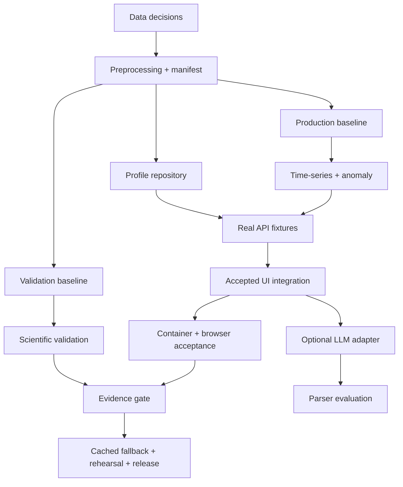

# FloatChat-Lite synchronized roadmap

> Source of truth for priorities and dependencies
> Rebuilt from current repository state on 21 August 2026

## Roadmap outcome

The next milestone is not “more features.” It is a truthful end-to-end profile and time-series/anomaly path from reviewed ARGO artifacts through `/chat` into the accepted UI, followed by recorded scientific, failure, deployment, and demo evidence.

## Priority model

- **P0 — Critical:** required for any real-data success path.
- **P1 — High:** required for a judge-ready, trustworthy release.
- **P2 — Medium:** useful after the deterministic core is stable.
- **P3 — Low:** optional future exploration.

## Completed

These items are genuinely present in source for their stated limited scope:

| Priority | Item | Verified current state |
| --- | --- | --- |
| P0 | Repository boundaries | Frontend, backend, data, scripts, deployment, demo, docs, and evidence areas exist. |
| P0 | Accepted illustrative UI | Four bundled flows, Recharts views, static map context, loading/error/reset, confidence and explanation presentation. |
| P0 | API safety scaffold | Typed models, `POST /chat` boundary, liveness/readiness, safe parse/data-unavailable errors. |
| P0 | Deterministic pinned parser | Four narrow phrase families, month/year extraction, `rule_based` tag, tests. |
| P0 | Anomaly/confidence policy | Boundary function and tests for labels, thresholds, zero std, and low-confidence suppression. |
| P1 | Engineering checks | Frontend/backend checks and GitHub Actions workflow exist. |
| P1 | Single-container recipe | Dockerfile and Compose configuration exist; runtime acceptance remains unverified. |

“Completed” here does not mean the product or scientific pipeline is complete.

## In progress

No active implementation work can be verified from repository state alone. Partially implemented foundations are listed under Completed with their limited scope and under Next where completion work remains. Assign owners before treating any roadmap item as actively in progress.

## Next

### P0 — freeze scientific inputs and build one real subset

**Dependencies:** source access and team decisions.

1. Freeze source/access/licence, Mumbai-first coverage, region/radius rules, QC policy, adjusted/raw precedence, depth rule, and shallow-water cutoff.
2. Implement deterministic NetCDF-to-Parquet preprocessing and manifest generation.
3. Manually review sample profiles and validate schema/ranges/duplicates/missing values.
4. Add manifest schema/hash/provenance verification.

**Exit:** a versioned reviewed profile artifact can be reproduced and one profile can be inspected/query-tested.

### P0 — build independent baselines

**Dependencies:** reviewed profile artifact and frozen regions/periods.

1. Implement production and validation baseline generation.
2. Store region/month/parameter, exact periods, mean, standard deviation, count, dataset version, and hashes.
3. Verify serving cannot read validation artifacts.

**Exit:** distinct reviewed artifacts exist; zero/insufficient standard-deviation policy is testable.

### P0 — implement repository and HTTP success

**Dependencies:** real profile and production baseline artifacts.

1. Implement profile, then time-series repository queries.
2. Compute sufficiency from matching profiles and connect anomaly/explanation logic.
3. Return validated success and `404 no_data` responses.
4. Freeze real fixtures and chart-data variants.

**Exit:** both core flows work through `/chat` with the deterministic parser and safe error paths.

## Planned

### P1 — integrate the accepted frontend

**Dependencies:** frozen real API fixtures.

- Reconcile frontend/backend types through a narrow adapter.
- Replace local runtime response selection with `/chat`.
- Add typed error and rule-parser disclosure UI.
- Preserve Recharts, static map, copy boundaries, layout, and interactions.
- Run keyboard, responsive, browser, and projector acceptance.

### P1 — validate and release

**Dependencies:** integrated real-data build.

- Run scientific validation and record exact positive/negative output.
- Build/start the container with ready data and run all smoke/error paths.
- Capture sanitized cached JSON/screenshots with provenance.
- Test offline recovery and rehearse; record actual outcomes.
- Freeze the build and remove unsupported pitch claims.

### P2 — optional provider and regional average

**Dependencies:** deterministic integrated core.

- Choose one LLM provider only after quota/latency review.
- Implement strict output validation, short timeout, and deterministic fallback.
- Run a frozen parser evaluation and forced failure cases.
- Include regional average only if data coverage and core stability support it.

## Blocked

| Task | Blocking dependency | Unblock condition |
| --- | --- | --- |
| Real `/chat` success | No reviewed artifacts; repository unimplemented | Profile artifact + repository query |
| Frontend/API integration | No real fixture and incompatible types | Freeze success/data variants |
| Real anomaly results | No production baseline | Versioned production baseline |
| Scientific validation claim | No validation artifact/script/evidence | Separate validation baseline + recorded run |
| LLM evaluation | No provider decision; deterministic core incomplete | Working deterministic flow + one provider |
| Deployment/demo acceptance | No ready data/integration/evidence | Integrated release candidate and runbook gate |

## Future / long-term

### P3 — investigate only after release evidence

- Multilingual access.
- PFZ, wave-height, cyclone, or forecast data as separately governed domains.
- Multi-turn conversation, accounts, persistence, mobile, or WhatsApp.
- Alternative storage/scaling only after measured need.
- More advanced anomaly methods only if the explainable baseline is insufficient and evaluation criteria are defined.

## Dependency map

## Milestone acceptance

| Milestone | Required evidence |
| --- | --- |
| M1 Data ready | Manifest/version/provenance/QC/hash review and manually checked profiles |
| M2 Core API | Real profile and time-series responses plus success/no-data/sparse/zero-std tests |
| M3 Integrated UI | Browser evidence for both core flows and typed failures without illustrative ambiguity |
| M4 Scientific/provider evidence | Exact validation output; parser result only if provider ships |
| M5 Release | Container/local, cached fallback, projector, recovery, and rehearsal records |

## Scope cut order

1. Narrow geographic/time coverage to the reviewed subset.
2. Keep the current static map; do not add map interactivity.
3. Cut regional average.
4. Cut the optional LLM adapter and keep the disclosed deterministic grammar.

Do not cut provenance, confidence, safe errors, scientific integrity, evidence, or rehearsal.
