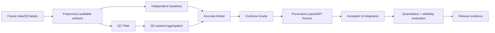

# FloatChat-Lite synchronized roadmap

> Rebuilt from Rev. B requirements and current repository state on 21 August 2026

## Outcome

Deliver a QC-gated real-data path whose anomaly and reliability claims are reproducible. The critical dependency chain is:

## Completed

- Accepted illustrative React/Vite/Recharts UI with four local flows.
- FastAPI request/error/health foundation and narrow deterministic parser.
- Isolated legacy Z-score/profile-count tests.
- Data/baseline directories, manifest schema, CI/checks, container recipe, evidence/demo boundaries.
- Rev. B structural boundaries: `qc.py`, `evidence.py`, `explain.py`, backend fixture directory, and `evaluation/` workspace.

Structural files are not completed scientific features.

## In progress

No owner/activity can be verified. Assign owners before marking implementation work active.

## Next — P0

### Freeze scientific and evaluation policy

- Exact ARGO source/licence/subset/regions/radii.
- Accepted QC flags, raw/adjusted precedence, `data_mode`, profile identity, shallow-water cutoff.
- Baseline periods/minimum `n`, distinct-float/spatial thresholds, QC pass-rate threshold, and grade reasons.
- Ground-truth/labeling method and query-coverage denominator for evaluation.

### Build auditable artifacts

- Deterministic preprocessing retaining QC/data-mode audit fields.
- Reviewed manifest with provenance, coverage, policy, command, version, and hashes.
- Separate production/validation baselines with mean/std/`n`.

### Implement QC-gated core

- Repository profile then time-series retrieval.
- QC Filter with retained/excluded counts, reasons, pass rate, distinct floats, warning.
- Anomaly Model over QC-passed aggregates only.
- Evidence Grade/reasons and provenance panel.
- Target success, `no_data`, QC-warning, sparse/zero-std, and trace-safety tests.

## Planned — P1

### Contract and UI integration

- Freeze reviewed real response variants.
- Complete migration from legacy internal `Confidence` to the structurally defined target evidence-grade response.
- Resolve Plotly/Leaflet target versus accepted Recharts/static-map implementation.
- Add API adapter, typed failures, QC warning, grade badge, fallback disclosure, and expandable panel.

### Quantitative validation and reliability

- Compare regional-average, unfiltered Z-score, and full QC/evidence pipeline.
- Report confusion counts, precision, recall, F1, false-alert rate, coverage, and response time.
- Run 20–30-query parser/API reliability test with LLM disabled and simulated failures; report invalid rate and average/p95 latency.
- Review outputs and log claims without editing negative results.

### Release

- Verify container/local health and pinned/error flows.
- Capture complete sanitized cached responses including QC/grade/provenance.
- Test browser/projector/offline recovery and record rehearsals.

## Planned — P2

- Add one optional LLM adapter only after the deterministic core works.
- Add regional average only if QC-passed coverage is stable.
- Improve readiness integrity checks and accessibility acceptance.

## Blocked

| Task | Blocker |
| --- | --- |
| Real API success | No reviewed data/repository/QC implementation |
| Target evidence grade | Thresholds/logic not frozen; structural models only |
| UI integration | No reviewed target fixture; frontend-library decision unresolved |
| Accuracy/precision claims | No labels/notebook/results |
| Parser reliability/latency | No provider adapter or frozen test set |
| Release acceptance | No integrated real-data candidate/evidence |

## Future — P3

Multilingual, PFZ/wave/cyclone/forecast domains, memory/accounts, database, advanced ML, mobile/WhatsApp, and scaling are unscheduled until the QC-gated core is validated.

## Scope cut order

1. Narrow reviewed coverage.
2. Keep static geographic context rather than add map interaction.
3. Cut regional average.
4. Cut optional LLM; retain deterministic parser.

Never cut QC filtering, grade reasons, provenance, safe failures, evaluation integrity, or rehearsal.
