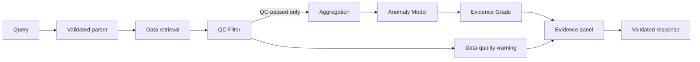

# FloatChat-Lite project handbook

> Detailed target/current baseline
> Rev. B synchronization: 21 August 2026

## 1. Purpose and scientific claim boundary

FloatChat-Lite aims to answer supported Indian Ocean ARGO questions with computation transparency. It must first determine whether observations are trustworthy, then determine whether trustworthy aggregates are unusual. A QC failure is not an ocean event, and a sparse-profile Z-score is not a marine-heatwave detector.

Current UI values remain illustrative. No real ARGO result, evidence grade, anomaly accuracy, parser reliability, or latency figure is verified.

## 2. Vocabulary

| Term | Definition |
| --- | --- |
| QC Filter | Mandatory data-quality stage that applies frozen ARGO QC/data-mode/adjusted-value rules before anomaly scoring. |
| Data-quality warning | Separate output describing rejected/thin trustworthy data; not an anomaly label. |
| Anomaly Model | Z-score classification over QC-passed aggregates and production baselines only. |
| Evidence Grade | `Insufficient`, `Indicative`, or `Supported` based on several trust signals. |
| Evidence panel | Expandable “Why this result?” computation/provenance values. |
| Production baseline | Live-answer baseline; never validation evidence. |
| Validation baseline | Independent evaluation artifact; never used for live answers. |
| Shallow-water SST proxy | Documented shallow ARGO measurement proxy; not satellite SST. |

## 3. Target flow and responsibilities

- Retrieval selects matching raw records and reports raw counts.
- QC owns acceptance/rejection and data-mode precedence.
- Anomaly scoring never inspects rejected records.
- Evidence grading uses valid count, baseline `n`, distinct floats/spatial spread, and QC pass rate.
- Provenance composition reports actual inputs/intermediates; it does not invent explanations.

## 4. Evidence grade

- **Insufficient:** fewer than five valid current profiles or inadequate baseline `n`.
- **Indicative:** score can be computed but float/spatial coverage is limited.
- **Supported:** all frozen valid-count, baseline, coverage, and QC-pass conditions hold.

The reviewed dataset must determine unresolved baseline/coverage/pass-rate thresholds. The old 1–5/6–20/21+ confidence tiers remain only in legacy code/UI and are not the target methodology.

## 5. Data requirements

Prepared records must retain float/profile identity, time, coordinates, depth, temperature/salinity, QC flags, raw/adjusted values or documented chosen values, and `data_mode`. The manifest records source/licence/provenance, coverage, QC policy, build command, dataset version, artifact hashes, and separate production/validation kinds.

## 6. Quantitative validation

One frozen evaluation must compare regional-average, unfiltered-Z-score, and full QC-filtered/evidence-graded methods on the same labels/subset. Report confusion counts, precision, recall, F1, false-alert rate, query coverage, and response time. Label creation and denominators are part of the result.

Parser/API reliability must use 20–30 paraphrases, explicit model-disabled operation, invalid output, fallback, average/p95 latency, no-data, sparse-data, malformed dates, and simulated provider failure.

No placeholder metric or target may be presented as observed.

## 7. Current implementation

- Accepted frontend: bundled illustrative responses, Recharts, static map, legacy confidence.
- Backend: deterministic pinned parser, typed health/error boundary, existence-based readiness, legacy anomaly policy.
- Structural additions: `qc.py`, `evidence.py`, `explain.py`, test-fixture boundary, and `evaluation/` workspace.
- Structural target models exist, but scientific logic/data, runtime success, frontend integration, evaluations, evidence, and release acceptance are missing.

## 8. Current/target frontend decision

Rev. B target documents specify Plotly/Leaflet; source uses Recharts/static Bhuvan context and is protected as accepted UI. No library migration is implied by documentation/structure synchronization. Owners must explicitly decide whether to migrate or amend the target documents.

## 9. Security and honesty

- No accounts, authentication, PII, or chat persistence.
- Query text is untrusted and never executable/path input.
- Provider secrets remain server-side and absent from notebooks/results/demo captures.
- Errors remain safe and trace-free.
- Use “upper-ocean temperature anomaly”/“salinity anomaly,” not marine heatwave.
- Use “computation transparency/provenance,” not model-attribution XAI.

## 10. Repository and workflow

See [project documentation](PROJECT_DOCUMENTATION.md) for the tree and commands, [API contract](API_CONTRACT.md) for migration, and [evaluation workspace](../evaluation/README.md) for reproducibility rules.

## 11. Known issues

### Critical

- No reviewed ARGO artifacts, frozen QC policy, baselines, repository success, or QC implementation.
- Target evidence-grade/evidence-panel contract is absent.

### High

- Legacy frontend/backend contracts diverge from each other and Rev. B.
- No quantitative labels/notebooks/results or response-reliability evidence.
- Readiness checks existence, not schema/hash/QC/scientific validity.

### Medium

- Provider/hosting and frontend library decisions are unresolved.
- Suggested queries, typed frontend errors, and parser disclosure are absent.

## 12. Definition of done

- Reviewed versioned ARGO subset retains auditable QC/data-mode fields.
- QC rejection is tested before anomaly scoring and retained/excluded counts are reported.
- Independent production/validation baselines exist.
- Core real-data flows return target responses with evidence grades/reasons and actual provenance values.
- Three-method anomaly comparison and parser/API reliability outputs are reproducible and logged.
- Browser/projector, one-container, cached fallback, recovery, and rehearsal evidence is recorded.

## 13. References and related decisions

- [PRD Rev. B](prd.md)
- [Architecture Rev. B](ARCHITECTURE.md)
- [ADR 0002](adr/0002-qc-before-anomaly-and-evidence-grading.md)
- [Argo data sources](https://argo.ucsd.edu/data/)
- [Using Argo profile files](https://argo.ucsd.edu/data/how-to-use-argo-files/)
- [INCOIS Indian ARGO ERDDAP](https://erddap.incois.gov.in/erddap/tabledap/Indian_ARGO_Floats.html)

External references support planning; they do not prove current ingestion, accuracy, reliability, or deployment.
