# FloatChat-Lite critical-path execution plan

> Status: synchronized to the current repository on 21 August 2026

The original UI shell and backend safety foundation exist. The data path is now the critical path. This plan starts from the current checkout; it does not pretend the sprint is still at hour zero.

## Verified starting point

| Area | Status | Evidence in repository |
| --- | --- | --- |
| Accepted illustrative UI | ✅ Implemented | React/Vite/Recharts components and local typed responses under `frontend/`. |
| API safety foundation | 🟡 Partial | Models, health endpoints, deterministic parser, safe errors, anomaly policy, and tests under `backend/`. |
| Scientific artifacts | 🔴 Blocked | No `data/manifest.json`, processed Parquet, or baseline artifacts. |
| Scientific scripts | 🟠 Planned | Only script requirements are documented; preprocessing/baseline/validation/evaluation entrypoints do not exist. |
| End-to-end real-data result | 🔴 Blocked | Repository `query()` deliberately raises `DataUnavailable`; frontend has no API client. |
| Demo evidence | 🟠 Planned | Evidence log has headers only; cached/demo directories contain placeholders only. |

## Dependency order

```mermaid
flowchart LR
    A[Freeze source, subset, regions and QC policy] --> B[Preprocess ARGO to versioned Parquet]
    B --> C[Build separate production and validation baselines]
    C --> D[Implement repository queries]
    D --> E[Freeze real API response fixtures]
    E --> F[Connect accepted frontend to POST /chat]
    F --> G[Validate failure paths and science]
    G --> H[Build, cache and rehearse release]
```

## H0–H4: make one scientific record set reproducible

- Freeze the data source, licence/access notes, pinned subset, region definitions, QC rules, shallow-water cutoff, and response fixture owner.
- Implement deterministic NetCDF-to-Parquet preprocessing with explicit paths, validation, non-zero failure, and manifest draft output.
- Inspect adjusted values, QC flags, schema, ranges, duplicates, missing values, and several known profiles.
- Protect the existing frontend; do not replace illustrative values with unlabeled data.

Gate: a repeatable command creates a reviewed profile artifact and manifest draft. If full ingestion is late, deliberately choose a smaller real subset that covers the pinned profile and time-series questions.

## H4–H9: prove repository and baseline boundaries

- Implement profile retrieval first, then time-series; add regional average only after both are stable.
- Build separate production and validation baselines with mean/std/count, periods, parameter, region, and dataset version.
- Add manifest schema/hash/provenance verification and repository fixture tests.
- Run the validation script and record the exact positive or negative result.

Gate: one real profile query works from a script, and zero/insufficient-standard-deviation paths are verified.

## H9–H15: freeze the API and integrate

- Make `POST /chat` return the validated success model and `404 no_data` where appropriate.
- Freeze reviewed real fixtures for profile and time-series; reconcile the frontend `OceanResponse` model with `ChatResponse` deliberately.
- Replace local resolution with an API adapter while preserving the accepted UI and its states.
- Add the optional LLM parser only after the deterministic path works; enforce schema validation, a short timeout, and rule-based fallback.

Gate: profile and time-series/anomaly work end-to-end with the LLM absent or forced to fail.

## H15–H19: measure and freeze

- Add regional average only if the two core flows are stable.
- Run the frozen parser evaluation and scientific validation.
- Record exact commands, dataset/build versions, observed results, owners, and dates.
- Freeze features; remove or label unsupported claims.

Gate: every claimed result has an evidence-log entry. Negative evidence is acceptable.

## H19–H24: release and rehearse

- Build the one-container release and run health, pinned-query, and typed-error smoke checks.
- Capture sanitized cached JSON/screenshots with dataset/build provenance and verify offline opening.
- Test projector, browser, network-loss, and provider-failure behaviour on the presentation setup.
- Rehearse the complete flow and record actual pass/failure counts.

Gate: live/local and cached paths work, the release is frozen, and each known failure has a named mitigation.

## Scope cut order

1. Drop broad regional coverage.
2. Keep a static location image/marker; do not add map interactivity.
3. Drop regional average.
4. Narrow free-form grammar and use the disclosed deterministic parser.

Never cut provenance, confidence disclosure, safe errors, evidence, or rehearsal time to preserve a feature.
