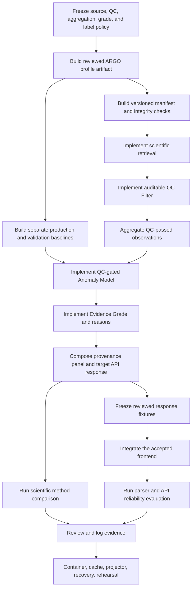

# FloatChat-Lite Beginner Development Roadmap

## QC-Gated ARGO Exploration and Evidence Roadmap

FloatChat-Lite is a narrow hackathon demonstration for conversational exploration of supported Indian Ocean ARGO temperature and salinity data. Its core scientific rule is:

> First decide whether the measurements are trustworthy; only then decide whether the trustworthy aggregate is oceanographically unusual.

This roadmap follows the organization of the supplied AlgoMemtor roadmap—ordered phases, weekly learning goals, build tasks, acceptance checks, risks, and a final checklist—but all FloatChat status and tasks come from this repository. A checked item means the current repository contains the stated foundation. It does **not** mean that real ARGO results, scientific accuracy, reliability, or deployment have been validated.

Weeks are planning units, not promises. For a 48-hour hackathon sequence, use [HACKATHON_EXECUTION.md](HACKATHON_EXECUTION.md); keep the dependency order below.

---

## Table of Contents

1. [How to Follow the Roadmap](#1-how-to-follow-the-roadmap)
2. [Current Starting Point](#2-current-starting-point)
3. [Build Order](#3-build-order)
4. [Milestone Summary](#4-milestone-summary)
5. [Phase 0 — Scientific and Product Policy](#5-phase-0--scientific-and-product-policy)
6. [Phase 1 — Auditable ARGO Data](#6-phase-1--auditable-argo-data)
7. [Phase 2 — Scientific Retrieval and QC](#7-phase-2--scientific-retrieval-and-qc)
8. [Phase 3 — Anomaly Scoring and Evidence](#8-phase-3--anomaly-scoring-and-evidence)
9. [Phase 4 — API Contract and Core Flows](#9-phase-4--api-contract-and-core-flows)
10. [Phase 5 — Accepted UI Integration](#10-phase-5--accepted-ui-integration)
11. [Phase 6 — Optional LLM Parser](#11-phase-6--optional-llm-parser)
12. [Phase 7 — Quantitative Validation](#12-phase-7--quantitative-validation)
13. [Phase 8 — Hardening, Demo, and Release](#13-phase-8--hardening-demo-and-release)
14. [After the MVP](#14-after-the-mvp)
15. [Working Method](#15-working-method)
16. [Risk Register](#16-risk-register)
17. [Final MVP Checklist](#17-final-mvp-checklist)

---

# 1. How to Follow the Roadmap

## 1.1 Work in dependency order

Do not start anomaly presentation, UI integration, or accuracy claims before the data and QC gates are complete. The required runtime order for anomaly requests is:

```text
retrieve matching records
  → apply the frozen ARGO QC/data-mode policy
  → aggregate QC-passed observations
  → score against the production baseline
  → compute the Evidence Grade and reasons
  → compose the computation-transparency panel
```

The Anomaly Model must never receive raw or QC-rejected observations.

## 1.2 Weekly completion rule

A week is complete only when:

- its acceptance checks pass;
- relevant automated checks pass;
- scientific or reliability claims have reproducible evidence where required;
- documentation describes what was observed, including negative results; and
- the next phase's prerequisites exist.

Lint, build, and unit-test success are engineering gates. They are not proof of anomaly accuracy, parser reliability, real-data readiness, deployment, projector behavior, or rehearsal success.

## 1.3 Scope rule

Keep the MVP narrow:

- ARGO temperature and salinity only;
- profile and time-series/anomaly flows first;
- regional average only if QC-passed coverage is stable;
- deterministic parsing before any optional provider;
- versioned Parquet artifacts and separate baseline files, with no database;
- one stateless FastAPI service and the accepted React frontend; and
- no authentication, chat history, vector search, fine-tuning, microservices, or unrelated ocean domains.

## 1.4 Scientific stop rule

Stop and resolve the policy instead of guessing when any of these are unknown:

- accepted ARGO QC flags;
- raw-versus-adjusted value precedence;
- `data_mode` handling;
- profile identity and aggregation rules;
- shallow-water proxy cutoff;
- production and validation baseline periods;
- minimum baseline `n`, distinct-float/spatial, or QC-pass thresholds; or
- evaluation labels and denominators.

Only the “fewer than five valid current profiles means `Insufficient`” rule is currently numerically frozen. Do not invent the other thresholds.

## 1.5 Claim stop rule

Do not publish accuracy, precision, recall, F1, false-alert rate, query coverage, parser reliability, latency, deployment, or rehearsal claims until the exact observed result is reviewed and recorded in `docs/evidence/evidence-log.csv`.

---

# 2. Current Starting Point

The current repository is a verified foundation, not an integrated scientific application.

| Area | Status | Verified current state |
| --- | --- | --- |
| Illustrative frontend | ✅ Available | React 19, TypeScript 5.9, Vite 8, Recharts, a static Bhuvan map image, and four bundled illustrative flows. |
| API safety foundation | 🟡 Partial | FastAPI/Pydantic request boundary, health endpoints, narrow deterministic parser, and sanitized refusal/error paths. No scientific success response exists. |
| Data readiness | 🟡 Partial | Manifest existence checks exist. No reviewed manifest or query-ready ARGO artifact is installed. |
| QC Filter | 🟠 Planned structure | `backend/app/services/qc.py` defines ownership only; policy, implementation, and tests are absent. |
| Anomaly Model | 🟡 Legacy scaffold | An isolated Z-score/profile-count policy exists, but it is not QC-gated or integrated with real data. |
| Evidence Grade | 🟠 Planned structure | Target vocabulary and service boundary exist; multi-signal logic and thresholds are incomplete. |
| Evidence panel | 🟠 Planned structure | Composer ownership exists; no runtime composition or expandable UI exists. |
| Evaluation | 🟠 Planned structure | Folders exist, but frozen fixtures, labels, notebooks/scripts, and results do not. |
| Evidence log | 🔴 Empty | No quantitative, release, or rehearsal result is currently claimable. |

The current frontend uses legacy profile-count confidence and illustrative values. Preserve it until reviewed target response fixtures exist and an explicit decision resolves the target Plotly/Leaflet description versus the current Recharts/static-map implementation.

---

# 3. Build Order



The optional LLM parser is deliberately outside the critical path. The deterministic path must remain usable when the provider is disabled, misconfigured, slow, unavailable, or returns malformed output.

---

# 4. Milestone Summary

| Week | Priority | Milestone | Required deliverable |
| --- | --- | --- | --- |
| 1 | P0 | Freeze scientific/product policy | Reviewed policy for data, QC, aggregation, grades, labels, scope, and UI direction |
| 2 | P0 | Prepare auditable ARGO data | Reviewed profile artifact plus provenance-rich versioned manifest |
| 3 | P0 | Build independent baselines | Separate production and validation artifacts with mean/std/`n` and integrity metadata |
| 4 | P0 | Implement scientific retrieval | Schema-aware profile query, then time series, with explicit `no_data` behavior |
| 5 | P0 | Enforce QC before anomaly | Auditable retained/excluded results and a test proving rejection precedes scoring |
| 6 | P0 | Implement anomaly and Evidence Grade | QC-only scoring, safe sparse/zero-std handling, grades, and reasons |
| 7 | P0 | Complete target API flow | Typed real response variants and actual provenance-panel values |
| 8 | P1 | Integrate the accepted frontend | Reviewed adapter and UI states for quality, grade, evidence, parser, and errors |
| 9 | P2 | Add optional LLM adapter | One server-side provider with transparent deterministic fallback |
| 10 | P1 | Validate anomaly methods | Three-method comparison on one frozen ARGO subset and labels |
| 11 | P1 | Validate parser/API reliability | Frozen paraphrase and failure suite with exact reliability and latency reports |
| 12 | P1 | Harden and rehearse | Verified container/local paths, sanitized cache, projector/recovery checks, evidence log, and rehearsal |

---

# 5. Phase 0 — Scientific and Product Policy

## Week 1: Freeze the rules before writing scientific logic

### Goal

Turn unresolved scientific assumptions into one reviewed policy that every later stage can implement and test.

### Learn

- How ARGO profile variables, QC flags, adjusted values, and data modes relate.
- Why data-quality filtering and ocean-event detection are different questions.
- Why a production baseline cannot also serve as independent validation evidence.
- Why sparse ARGO Z-scores must not be labeled as marine heatwaves.

### Build tasks

1. Select the exact ARGO source, licence, subset, regions, coordinates, date coverage, and query radii.
2. Define retained audit fields: float/profile identity, coordinates, time, depth, raw/adjusted temperature and salinity where available, parameter QC flags, and `data_mode`.
3. Freeze accepted QC flags and raw/adjusted/data-mode precedence for historical analysis.
4. Define profile selection, spatial selection, aggregation, duplicate handling, and shallow-water proxy behavior.
5. Define production and validation baseline periods and artifact separation.
6. Freeze Evidence Grade thresholds and reason codes after reviewing the chosen dataset; keep the existing fewer-than-five rule.
7. Define anomaly labels, ground-truth construction, exclusions, metric denominators, and query-coverage calculation.
8. Decide whether the MVP keeps Recharts/static geographic context or explicitly migrates to Plotly/Leaflet.
9. Assign owners to policy, data, backend, frontend, evaluation, and demo evidence.

### Acceptance checks

- [x] Source, licence, subset, regions, radii, and date range are recorded in `docs/SCIENTIFIC_POLICY.md`.
- [x] Accepted QC flags and value/data-mode precedence are explicit.
- [x] Aggregation and proxy rules are testable rather than implied.
- [x] Production and validation baseline policies cannot overlap operationally.
- [ ] Every Evidence Grade condition has a dataset-reviewed threshold and reason.
- [x] Evaluation labels and denominators are reproducible.
- [x] Frontend library direction is recorded without silently redesigning the accepted UI.

### Deliverable

[Scientific and evaluation policy](SCIENTIFIC_POLICY.md). Its source, QC,
aggregation, baseline, evaluation, UI, and ownership rules are frozen. Final
Evidence Grade thresholds remain fail-closed until the correct 2015–2024
dataset is installed and its coverage distributions are reviewed.

### Common mistakes

- Choosing thresholds because they produce attractive results.
- Treating a QC-rejected extreme value as a genuine ocean event.
- Calling shallow ARGO temperature satellite SST.
- Presenting a target architecture choice as current implementation.

---

# 6. Phase 1 — Auditable ARGO Data

## Week 2: Build a reviewed query-ready profile artifact

### Goal

Create a deterministic offline path from the selected ARGO source to a small, inspectable Parquet artifact that retains enough metadata to audit every exclusion.

### Build tasks

1. Implement the preprocessing command under `scripts/` using pandas/xarray/PyArrow as needed.
2. Retain the reviewed profile identity, location, time, depth, raw/adjusted values, QC flags, and data-mode fields.
3. Normalize dates, coordinates, units, missing values, and identifiers deterministically.
4. Record source URL/provider, licence, retrieval date, coverage, build command, policy version, artifact version, row/profile/float counts, and hashes in `data/manifest.json`.
5. Review representative accepted, rejected, adjusted, delayed-mode, shallow, sparse, and missing-value profiles manually.
6. Add schema and manifest tests without embedding large raw datasets in Git.

### Acceptance checks

- [ ] A clean checkout plus documented source input can reproduce the processed artifact.
- [ ] Required QC and data-mode fields survive preprocessing.
- [ ] Manifest paths, hashes, schema, versions, and counts match actual artifacts.
- [ ] Representative rows have been manually compared with their source records.
- [ ] Secrets, local paths, and licensed large raw files are absent from tracked outputs.

### Deliverable

One versioned, reviewed, query-ready ARGO profile artifact and manifest.

## Week 3: Build separate production and validation baselines

### Goal

Precompute baseline statistics offline without contaminating scientific evaluation.

### Build tasks

1. Build the production baseline used by live anomaly responses.
2. Build a separately versioned validation baseline used only for method evaluation.
3. Store region/month or other frozen grouping keys, mean, standard deviation, and `n`.
4. Record input artifact version/hash, policy version, coverage, build command, and baseline kind.
5. Test missing groups, insufficient `n`, zero standard deviation, and cross-kind misuse.

### Acceptance checks

- [ ] Production and validation files are physically and logically separate.
- [ ] Every baseline row records mean, standard deviation, and `n`.
- [ ] Runtime code cannot accidentally select a validation baseline.
- [ ] Evaluation code cannot present the production baseline as independent evidence.
- [ ] Rebuilding from identical inputs produces equivalent results.

### Deliverable

Independent, versioned production and validation baseline artifacts.

---

# 7. Phase 2 — Scientific Retrieval and QC

## Week 4: Implement retrieval without scientific judgment

### Goal

Make the Data Layer select matching records and compute requested aggregates without deciding whether observations are trustworthy or anomalous.

### Build tasks

1. Replace the current refusal-only repository query with schema-aware artifact loading.
2. Implement profile retrieval first using the frozen spatial, temporal, parameter, and depth rules.
3. Implement time-series retrieval after profile behavior is stable.
4. Preserve raw record/profile counts and identifiers needed by the QC stage.
5. Return explicit `no_data` when no records match.
6. Add readiness checks for schema, hash, artifact kind, and required QC fields—not file existence alone.
7. Add regional average only if reviewed QC-passed coverage supports it.

### Acceptance checks

- [ ] Retrieval returns only records matching the frozen selection policy.
- [ ] Retrieval does not filter QC flags or assign anomaly labels.
- [ ] `no_data` is typed, friendly, and trace-free.
- [ ] A corrupt, mismatched, or scientifically incomplete artifact fails readiness safely.
- [ ] Profile tests use reviewed fixtures with known expected selections.

### Deliverable

Reliable profile retrieval and, next, time-series retrieval over versioned artifacts.

## Week 5: Enforce the QC Filter boundary

### Goal

Prevent suspect measurements from entering aggregation or anomaly scoring while keeping exclusions auditable.

### Build tasks

1. Implement the frozen accepted-QC and adjusted/data-mode policy in `backend/app/services/qc.py`.
2. Return raw, valid, and excluded counts; exclusion reasons; QC pass rate; valid profile count; and distinct-float count.
3. Produce a data-quality warning for thin or heavily rejected results.
4. Aggregate only retained observations.
5. Test accepted, rejected, mixed-QC, adjusted-precedence, sparse, and all-rejected cases.
6. Add an interaction test proving rejected observations never reach the Anomaly Model.

### Acceptance checks

- [ ] Every retained or excluded record is explainable by the frozen policy.
- [ ] Excluded counts and reasons remain available for the response panel.
- [ ] All-rejected data produces a quality/no-data outcome, not an anomaly.
- [ ] The Anomaly Model receives only QC-passed aggregates.
- [ ] Changing a rejected extreme value cannot change the anomaly score.

### Deliverable

An auditable QC boundary with enforced stage order.

### Common mistakes

- Filtering in both the repository and QC service with different rules.
- Hiding rejected counts from the user.
- Letting the anomaly scorer “decide” whether a raw record is bad.

---

# 8. Phase 3 — Anomaly Scoring and Evidence

## Week 6: Implement QC-gated anomaly scoring and Evidence Grade

### Goal

Classify unusual trustworthy aggregates and communicate how well the result is supported.

### Learn

- The Z-score calculation `z = (x - mean) / std` and its assumptions.
- The difference between anomaly severity and evidence strength.
- Why sample size, independent float coverage, spatial spread, and QC pass rate must remain visible.

### Build tasks

1. Refactor `backend/app/services/anomaly.py` to accept only a QC-passed aggregate and production baseline.
2. Keep anomaly severity separate from evidence strength.
3. Skip scoring when the production baseline is missing, baseline standard deviation is zero, or evidence is insufficient.
4. Implement the frozen anomaly label boundaries and plain-language explanation.
5. Implement centralized Evidence Grade logic in `backend/app/services/evidence.py` using valid profiles, baseline `n`, distinct floats/spatial coverage, and QC pass rate.
6. Return explicit grade reasons, not a bare label.
7. Remove legacy profile-count confidence from the target response while retaining it only where old scaffold tests still require migration.
8. Test boundary values and combined conditions.

### Acceptance checks

- [ ] No raw or rejected record can enter scoring.
- [ ] Production baselines are the only runtime scoring baselines.
- [ ] Zero-standard-deviation and insufficient-evidence cases produce no Z-score.
- [ ] `Insufficient` suppresses colored anomaly severity.
- [ ] `Indicative` is qualified as provisional.
- [ ] `Supported` requires every frozen condition.
- [ ] Results use “upper-ocean temperature anomaly” or “salinity anomaly,” not “marine heatwave.”

### Deliverable

A deterministic QC-gated anomaly result with an Evidence Grade and explicit reasons.

---

# 9. Phase 4 — API Contract and Core Flows

## Week 7: Return complete, typed, transparent responses

### Goal

Make `POST /chat` orchestrate the target stages and return values that can be traced to actual computations.

### Build tasks

1. Freeze reviewed success fixtures for profile, time-series/anomaly, sparse/quality-warning, and optional regional-average flows.
2. Complete target Pydantic request/response models using [API_CONTRACT.md](API_CONTRACT.md).
3. Orchestrate parser → retrieval → QC → aggregation → anomaly → grade → panel in the required order.
4. Compose the evidence panel in `backend/app/services/explain.py` from actual values only.
5. Include source/version, selection, dates, radius/region, raw/valid/excluded counts, distinct floats, QC rule/pass rate, grade/reasons, parser, current aggregate, baseline period/mean/std/`n`, score/label, and proxy caveat where relevant.
6. Finalize typed `parse_error`, `no_data`, and `general_error` HTTP mapping.
7. Test malformed requests, sparse data, all-rejected data, missing/corrupt artifacts, zero standard deviation, and trace safety.

### Acceptance checks

- [ ] Every success field maps to a recorded input or computed intermediate.
- [ ] The returned stage order is enforced by tests.
- [ ] Data-quality warnings are successful-result context, not ocean-event labels.
- [ ] `parser_used=rule_based` is always disclosed for deterministic parsing.
- [ ] Errors contain no internal paths, provider secrets, or stack traces.
- [ ] OpenAPI and reviewed fixtures agree with runtime responses.

### Deliverable

Profile and time-series/anomaly requests working end-to-end through HTTP with complete provenance.

---

# 10. Phase 5 — Accepted UI Integration

## Week 8: Connect the existing interface to reviewed responses

### Goal

Integrate the accepted frontend without a redesign and without displaying illustrative data as live results.

### Build tasks

1. Resolve and record the Recharts/static-map versus Plotly/Leaflet decision from Week 1.
2. Add one typed frontend API adapter against reviewed fixtures.
3. Preserve accepted layout, interactions, suggested flows, and current visual assets unless separately authorized.
4. Render loading, success, `parse_error`, `no_data`, `general_error`, and data-quality-warning states.
5. Replace legacy confidence presentation in integrated results with Evidence Grade behavior.
6. Add the expandable “Why this result?” computation-transparency panel.
7. Show deterministic-parser disclosure and shallow-water proxy caveats.
8. Ensure cached/illustrative content is visibly distinguished from live real-data responses.

### Acceptance checks

- [ ] The browser calls only `POST /chat`; it does not read data files or call a provider directly.
- [ ] `Insufficient` and `Indicative` presentation follows the grade policy.
- [ ] Every panel value matches the response fixture or live response exactly.
- [ ] Typed errors and quality warnings are understandable and trace-free.
- [ ] Existing desktop layout and interactions have not regressed.
- [ ] Keyboard, narrow-screen, and projector-focused checks are recorded.

### Deliverable

The accepted UI rendering reviewed real response variants honestly.

---

# 11. Phase 6 — Optional LLM Parser

## Week 9: Add one provider only after the deterministic core works

### Goal

Improve natural-language flexibility without making the provider a runtime dependency.

### Build tasks

1. Select one provider and one documented server-side model configuration.
2. Define a strict structured-output contract that maps only to supported query parameters.
3. Validate provider output through Pydantic before data access.
4. Apply a bounded timeout and fall back on missing configuration, timeout, quota failure, network failure, or malformed output.
5. Keep the API key server-side and out of tracked files, logs, notebooks, cached responses, screenshots, and frontend bundles.
6. Disclose `parser_used=llm` or `parser_used=rule_based` in every success.
7. Preserve explicit model-disabled operation as a supported mode.

### Acceptance checks

- [ ] The deterministic parser works with the provider explicitly disabled.
- [ ] Every simulated provider failure falls back or returns a safe typed error.
- [ ] Invalid model output cannot become executable code or a filesystem path.
- [ ] Unsupported regions/parameters remain unsupported rather than guessed.
- [ ] No provider key appears in tracked or generated evidence artifacts.

### Deliverable

One optional, failure-tolerant parser adapter with transparent fallback.

---

# 12. Phase 7 — Quantitative Validation

## Week 10: Compare anomaly methods on frozen ARGO labels

### Goal

Quantify whether QC gating reduces data-quality false alerts while preserving detection of labeled oceanographic events.

### Method

Run the same frozen reviewed subset and labels through:

1. a regional-average baseline;
2. an unfiltered Z-score method; and
3. the complete QC-filtered, evidence-graded pipeline.

The labels must distinguish known/suspected measurement-quality problems from the chosen genuine-event definition. If trustworthy ground truth cannot be created, mark the result `NEEDS VERIFICATION` rather than inventing accuracy.

### Build tasks

1. Store frozen labels, regions, periods, and exclusions under `evaluation/fixtures/`.
2. Document label creation, reviewers, ambiguity handling, and denominators.
3. Implement a reproducible method-comparison command or notebook.
4. Record confusion counts for every method.
5. Compute precision, recall, F1, false-alert rate, query coverage, and response time using documented formulas.
6. Break out behavior for QC-rejected extremes, sparse results, and each Evidence Grade.
7. Save unedited generated reports under `evaluation/results/`.
8. Review results and record approved claims in the evidence log.

### Acceptance checks

- [ ] All three methods use identical frozen labels and evaluation rows.
- [ ] Production and validation baseline artifacts remain separate.
- [ ] Every reported metric includes its numerator, denominator, dataset version, and command.
- [ ] Negative and inconclusive results remain unchanged.
- [ ] Generated reports are not described as evidence until reviewed and logged.

### Deliverable

A reproducible three-method ARGO anomaly comparison with explicit limitations.

## Week 11: Measure parser and API response reliability

### Goal

Measure whether supported questions return correct, complete, and safe responses across paraphrases and failure conditions.

### Build tasks

1. Freeze 20–30 supported paraphrases covering the pinned query families.
2. Define expected structured parameters and response/error category for each query.
3. Run with the LLM explicitly disabled and, if implemented, enabled.
4. Simulate malformed provider output, timeout/quota/network failure, no data, sparse data, malformed dates, missing artifacts, and zero-standard-deviation baselines.
5. Measure parsing success, invalid-output rate, deterministic fallback, response completeness, average latency, and p95 latency.
6. Verify every successful response contains required quality, grade, provenance, and parser fields.
7. Record exact environment/build, request count, repetitions, and results.
8. Review and log only observed claims.

### Acceptance checks

- [ ] The frozen suite contains 20–30 documented queries.
- [ ] Model-disabled operation is explicitly tested.
- [ ] Forced provider failures produce the documented fallback or typed error.
- [ ] Average and p95 latency report sample size and environment.
- [ ] No-data, sparse-data, malformed-date, and internal-failure behavior is safe.
- [ ] Every accepted claim points to an evidence-log row and report artifact.

### Deliverable

A reproducible parser/API reliability report with response-completeness and failure evidence.

---

# 13. Phase 8 — Hardening, Demo, and Release

## Week 12: Build the release candidate and rehearse recovery

### Goal

Produce a demo that is scientifically honest, recoverable, and inspectable under presentation conditions.

### Functional tasks

- Verify pinned profile and time-series/anomaly flows against the reviewed dataset.
- Include regional average only if its QC-passed coverage gate is satisfied.
- Verify typed error and quality-warning flows.
- Confirm every displayed value matches the API response and evidence artifact.

### Runtime tasks

- Run `make check` and retain the exact result for the release candidate.
- Build and run the local container with versioned data artifacts.
- Verify live, provider-disabled, and simulated-provider-failure modes.
- Test remote and local recovery paths without silently changing datasets.

### Demo tasks

- Create sanitized cached responses containing the complete QC/grade/provenance contract.
- Clearly label cached and illustrative content.
- Test desktop, narrow-screen, projector contrast/readability, keyboard flow, and network-loss recovery.
- Rehearse the main flow, one quality/sparse case, and one failure/recovery flow.
- Audit every presentation metric against the evidence log.

### Acceptance checks

- [ ] `make check` passes for the release candidate.
- [ ] The container reaches live/ready health only with valid artifacts.
- [ ] Cached responses preserve source/version, QC, counts, grade/reasons, baseline, parser, and caveats.
- [ ] No cached file contains secrets, local paths, or edited metrics.
- [ ] Projector, offline/recovery, and rehearsal outcomes are recorded.
- [ ] Every quantitative statement is evidence-backed or explicitly labeled unverified.

### Deliverable

A frozen, rehearsed release candidate with a recoverable demo path and auditable claims.

---

# 14. After the MVP

## 14.1 Recommended order

### Stage A: Improve scientific coverage

- Add regions or years only through the same reviewed policy, manifest, QC, baseline, and evaluation process.
- Revisit evidence thresholds using observed coverage, without optimizing them to inflate `Supported` results.
- Improve spatial-coverage reasoning and uncertainty communication.

### Stage B: Improve query coverage

- Extend the deterministic grammar from frozen user-query evidence.
- Add multilingual support only after supported English flows are reliable.
- Add provider capabilities one at a time with model-disabled and failure evaluation.

### Stage C: Add formal ocean-event methods

- Add a formal marine-heatwave method only with appropriate daily SST data, seasonal percentile thresholds, duration rules, and independent validation.
- Keep it separate from the sparse ARGO upper-ocean anomaly method.

### Stage D: Scale measured bottlenecks

- Consider a database, background processing, caching, or service separation only after measurements show that file-backed single-service architecture is inadequate.
- Add accounts, memory, or persistence only if a validated product need requires them.

## 14.2 Still out of scope without a new decision

- Authentication and user accounts.
- Multi-turn memory and chat history.
- Vector search, LangChain, fine-tuning, or multiple model providers.
- PFZ, waves, cyclones, forecasts, and unrelated data domains.
- Mobile/WhatsApp clients, microservices, Kubernetes, and production-scale operations.

---

# 15. Working Method

## 15.1 Weekly rhythm

### Session 1 — Learn and plan

- Confirm the phase inputs and exit gate.
- Read the relevant source and target documents.
- Select a small vertical slice and reviewed fixtures.
- Record unresolved scientific decisions before implementation.

### Sessions 2–4 — Build

- Implement one responsibility at a time.
- Run the narrowest relevant test first.
- Add interaction tests at trust boundaries, especially QC → anomaly.
- Keep outputs reproducible and preserve negative results.

### Session 5 — Verify and document

- Run the phase acceptance checks.
- Compare current behavior with the target contract.
- Update documentation and evidence status.
- Do not mark the next phase active until prerequisites exist.

## 15.2 Task sizing

A useful task should usually:

- change one responsibility;
- have a clear input and output;
- include an observable acceptance check;
- avoid mixing scientific-policy decisions with unrelated UI work; and
- fit into one focused work session.

Examples:

- Good: “Return retained/excluded counts from the frozen QC policy and test mixed-QC records.”
- Too broad: “Finish anomaly detection.”
- Too early: “Display Supported anomalies in the UI” before grade thresholds and target fixtures exist.

## 15.3 Decision log

Use an ADR when changing a durable boundary such as:

- QC placement or accepted policy ownership;
- baseline separation;
- Evidence Grade methodology;
- frontend visualization libraries;
- hosting topology; or
- expansion beyond the single-service/file-backed MVP.

Preserve [ADR 0001](adr/0001-single-service-file-data.md) and [ADR 0002](adr/0002-qc-before-anomaly-and-evidence-grading.md) as the current decisions unless a reviewed ADR supersedes them.

---

# 16. Risk Register

| Risk | Impact | Mitigation | Current state |
| --- | --- | --- | --- |
| QC-rejected values appear as real events | Critical scientific error | Mandatory tested QC boundary before aggregation/scoring | Open; service boundary only |
| Grade thresholds are guessed | Unsupported confidence claim | Freeze against reviewed data and centralize policy/reasons | Open |
| Production/validation leakage | Invalid evaluation | Separate artifacts, kinds, hashes, and access tests | Open |
| ARGO ground truth is ambiguous | Misleading accuracy metrics | Document labeling, reviewers, uncertainty, and denominators; mark unverified when necessary | Open |
| Frontend displays illustrative values as live | User/judge deception | Reviewed fixtures, source-mode labeling, exact response mapping | Open |
| Target/current frontend libraries diverge | Unplanned redesign or documentation drift | Explicit Week 1 decision; preserve accepted UI by default | Open |
| Provider failure breaks the demo | Reliability failure | Deterministic parser, bounded timeout, server-only secret, forced-failure tests | Partially mitigated by current deterministic parser |
| Readiness accepts invalid artifacts | Incorrect scientific results | Schema/hash/kind/QC-aware readiness | Open; existence checks only |
| Sparse data receives a strong visual label | Overstated result | Suppress severity for `Insufficient`; qualify `Indicative` | Open |
| Metrics are edited or lack denominators | Invalid claims | Reproducible reports plus reviewed evidence log | Open; evidence log empty |
| Remote/network failure interrupts demo | Presentation failure | Verified local container and full-contract sanitized cache | Open |
| Scope expands before core validation | Core pipeline remains incomplete | Follow scope cut order and dependency gates | Active management required |

Scope cut order:

1. Narrow the reviewed geographic/time coverage.
2. Keep static geographic context instead of adding map interaction.
3. Cut regional average.
4. Cut the optional LLM provider and retain deterministic parsing.

Never cut QC filtering, grade reasons, provenance, safe failures, evaluation integrity, or rehearsal.

---

# 17. Final MVP Checklist

## Product and scope

- [ ] Supported regions, parameters, dates, radii, and query families are documented.
- [ ] Unsupported questions fail safely instead of being guessed.
- [ ] The product remains stateless and focused on ARGO temperature/salinity.

## Data and provenance

- [ ] A licensed/provenanced versioned ARGO subset is reproducible.
- [ ] Required QC, data-mode, adjusted/raw, float/profile, location, time, depth, and parameter fields are retained.
- [ ] Manifest schema, counts, versions, commands, and hashes are verified.
- [ ] Production and validation baselines are separately versioned.

## Scientific pipeline

- [ ] Retrieval, QC filtering, QC-passed aggregation, anomaly scoring, grading, and panel composition are separate.
- [ ] Rejected observations cannot reach anomaly scoring.
- [ ] Zero-standard-deviation and insufficient-evidence results skip Z-score output.
- [ ] Anomaly severity and Evidence Grade are not conflated.
- [ ] No sparse Z-score result is called a marine heatwave.

## API and security

- [ ] FastAPI validates every request and response.
- [ ] Query text is never executed or used as a filesystem path.
- [ ] `parse_error`, `no_data`, and `general_error` are friendly and trace-free.
- [ ] Provider keys remain server-side and absent from artifacts/logs.
- [ ] Model-disabled and forced-provider-failure paths are tested.

## Frontend

- [ ] The accepted UI consumes reviewed target fixtures and runtime responses.
- [ ] QC warnings, grades/reasons, parser disclosure, and the evidence panel render correctly.
- [ ] Illustrative/cached/live modes are distinguishable.
- [ ] Browser, narrow-screen, keyboard, and projector checks are recorded.

## Quantitative evidence

- [ ] Regional-average, unfiltered Z-score, and the full pipeline are compared on the same frozen labels/subset.
- [ ] Confusion counts, precision, recall, F1, false-alert rate, coverage, and response time include denominators and versions.
- [ ] The 20–30-query parser/API suite covers disabled-model and forced-failure behavior.
- [ ] Average/p95 latency, invalid-output rate, and response completeness are reproducible.
- [ ] Approved claims map to unchanged report artifacts and evidence-log rows.

## Release and demo

- [ ] Engineering checks pass for the frozen candidate.
- [ ] Local/container readiness validates scientific artifact integrity.
- [ ] Complete sanitized cached responses are available.
- [ ] Recovery flows and rehearsals are recorded.
- [ ] Presentation language matches the evidence actually available.

## Closing advice

The shortest credible path is not the path with the most features. It is the path where a reviewer can trace one supported question from an ARGO source record through QC decisions, aggregation, baseline scoring, Evidence Grade reasons, and the final UI—then reproduce the reported validation without hidden assumptions or edited numbers.
