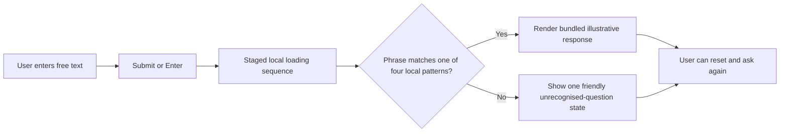

# FloatChat-Lite interface design

> Status: accepted illustrative frontend implemented; real-data integration planned
> Verified against `frontend/src/` on 21 August 2026

## 1. Design principles

- **Explain, do not merely answer.** Each rendered illustrative response includes a summary, chart reading, preparation notes, geographic context, and confidence.
- **Honesty over polish.** Current values are illustrative. Warming and anomaly wording is limited to the displayed dataset.
- **One response per query.** The interface is stateless and has idle, loading, success, error, and reset flows.
- **Preserve the accepted UI.** Integration work must adapt the contract without redesigning the layout, copy, interaction pattern, or libraries unless explicitly requested.
- **Desktop-first, responsive web.** The app targets a presentation/laptop screen and includes narrow-viewport styling; no native application is planned.

## 2. Current user flow

There are no suggested-query chips in the current UI, despite older documents describing them. The four example strings exist in the data module for matching/tests but are not rendered as controls. There is no network request, API failure state, no-data state, or parser disclosure yet.

## 3. Current screen and components

| Element | Implementation | Status |
| --- | --- | --- |
| Header and hero | `Header.tsx`, `FloatChatApp.tsx` | ✅ |
| Query form | `QueryComposer.tsx`; submit button, Enter handling, empty-input protection, reset | ✅ |
| Loading sequence | Three staged local messages | ✅ illustrative timing |
| Result metadata and insight | `ResultView.tsx` | ✅ |
| Charts | Recharts depth profile, time-series/trend, and salinity regional view | ✅ illustrative |
| Map context | Static local Bhuvan image with marker/region overlay | ✅ |
| Confidence | Gauge and profile-count thresholds (1–5 Low, 6–20 Medium, 21+ High) | ✅ illustrative |
| Anomaly/trend card | Low-confidence neutral suppression and medium provisional wording | ✅ component policy |
| Explanation | Preparation, grouping, baseline/score, caveat text | ✅ illustrative |
| Error | One unsupported-question message | 🟡 typed API errors not represented |
| Suggested chips | Not rendered | 🟠 optional/planned only if explicitly retained during contract integration |
| Rule-parser disclosure | Not represented in the frontend type | 🟠 planned |

## 4. Supported illustrative flows

| Local phrase match | View | Important disclosure |
| --- | --- | --- |
| Mumbai + temperature | Depth profile | Averaged illustrative observations. |
| SST / `19N` / `72.8` / unusual | Shallow-water time series and anomaly context | Illustrative baseline; proxy is not satellite SST. |
| Bay of Bengal + salinity | Monthly regional average | Seasonal pattern is visible in the illustrative dataset, not a validated regional conclusion. |
| Arabian Sea + warming | Trend direction | Describes only the displayed illustrative series. |

These are implemented UI demonstrations, not successful ARGO/API features.

## 5. Visual system

- Locally bundled Manrope Variable is the body/interface font.
- Locally bundled Space Grotesk Variable is used for headings and brand text.
- Core palette tokens are defined in `frontend/src/globals.css`: deep/panel blue-teal surfaces, teal accents, sand accents, amber, and three text tiers.
- Result surfaces are flat panels over an ocean video/poster background.
- Lucide icons accompany meaning; confidence/anomaly states use text and structure in addition to colour.
- Recharts uses responsive containers. The map has no external tiles or runtime network dependency.

Older Plotly/Leaflet/system-font descriptions are obsolete for the current frontend.

## 6. Accessibility and responsive behaviour

Implemented safeguards include labelled form controls, Enter submission, disabled states, semantic result sections, chart `role="img"` summaries, image alternative text, reduced-motion CSS, and responsive chart containers.

Accessibility conformance is ⚪ needs verification. No WCAG audit, keyboard-only browser acceptance, screen-reader review, contrast report, or projector check is recorded in the evidence log.

## 7. Target integrated flow

After real data and the API success contract are frozen:

1. Keep the existing input, loading, result, error, and reset interaction.
2. Replace local resolution with a typed `/chat` adapter.
3. Render distinct `parse_error`, `no_data`, and `general_error` messages.
4. Render `parser_used=rule_based` as a subtle simplified-matching disclosure.
5. Preserve confidence-aware anomaly presentation.
6. Ensure every success shows dataset/version, method, date/selection, profile count, confidence, and proxy caveat.

## 8. Remaining design decisions

- 🟠 Decide whether suggested queries are intentionally omitted or should be reintroduced during integration. This requires explicit product confirmation because the accepted UI currently omits them.
- 🟠 Define backend chart-data variants and a type adapter without changing current component behaviour.
- ⚪ Verify projector/narrow-screen readability and accessibility on the actual presentation setup.
- 🟠 Define loading/error copy for real API latency and typed failures.
