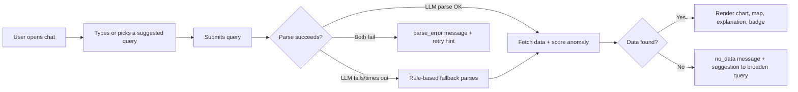

# FloatChat-Lite — Design Document

> **Status:** Draft | **Last updated:** 13 August 2026

## 1. Design Principles
- **Explain, don't just answer.** Every response carries its own "how we got this" — data source, method, and confidence — visible without a click, not buried in a tooltip.
- **Honesty over polish.** Thin data, degraded parsing, or low confidence are surfaced plainly (neutral badge, disclosure line) rather than hidden behind a confident-looking UI.
- **One clear answer per query.** No multi-turn state, no ambiguous partial results — a query resolves to one chart, one map, one explanation, one confidence level.
- **Progressive disclosure.** Lead with the plain-language summary and visual; put computation detail (baseline period, Z-score, profile count) in a secondary explanation footer, not the headline.
- **Familiar chat metaphor, novel content.** The interaction pattern (type a question, get an answer) is intentionally ordinary so users spend their attention on the ocean data, not on learning the UI.

## 2. User Flows

### 2.1 Ask a Question and Get an Answer

Narrative: the user opens the chat panel, either types a free-text question or taps a suggested query chip, and submits. The backend attempts to parse it with the LLM; if that fails or times out, the rule-based parser silently takes over (visibly disclosed after the fact, see 3.1). If neither parser can make sense of the query, the user sees a friendly `parse_error` message with an example of a working query. If parsing succeeds but no matching ARGO data exists, the user sees a `no_data` message with a suggestion to widen the region or time window. Otherwise, the full response renders: header, chart, map, anomaly badge (if applicable), and the explanation footer.

### 2.2 Reading an Anomaly Result
```mermaid
flowchart LR
    A[Response includes anomaly] --> B{data_sufficiency.confidence}
    B -->|low| C[Neutral gray badge: "Not enough data to assess"]
    B -->|medium| D[Colored badge + "provisional" qualifier]
    B -->|high| E[Colored badge at full weight]
    C --> F[Explanation footer: baseline, count, why]
    D --> F
    E --> F
```
Narrative: when a query includes or implies an anomaly check, the badge color depends entirely on `data_sufficiency.confidence`, never on the raw anomaly label alone. Low confidence always overrides the label into a neutral "not enough data" state. Medium confidence shows the real color but is marked provisional. High confidence shows the color at full weight. In every case, the explanation footer beneath the badge spells out the baseline period, the Z-score, and a one-sentence plain-language reason — so the badge is never the only piece of information a user acts on.

## 3. Key Screens / Views

### 3.1 Chat Panel (primary and only screen)
- **Purpose:** The single surface for asking a question and viewing its answer — no separate results page or navigation.
- **Key elements:** query input box; suggested query chips below it; response area containing (in order) a header restating the parsed query, a Plotly chart, a Leaflet map with a location pin, an anomaly badge (when relevant), an explanation footer, and a data-sufficiency line ("Based on 15 profiles within 50km — high confidence").
- **States:**
  - *Empty* — just the input box and the four suggested query chips ("Show temperature profile near Mumbai in July 2024," "Plot SST time series at 19N, 72.8E (2015-2024)," "Average salinity in Bay of Bengal in 2023," "Is the Arabian Sea warming over time?").
  - *Loading* — input disabled, a lightweight spinner or skeleton where the chart/map will appear; no fake data shown.
  - *Error* — `no_data`, `parse_error`, or `general_error` message rendered in place of the chart, in plain conversational language, never a raw error string.
  - *Populated* — full response with header, chart, map, badge (or neutral badge), explanation footer, data-sufficiency line, and — when applicable — the degraded-mode disclosure line.

### 3.2 Anomaly Badge (embedded component, not a standalone screen)
- **Purpose:** Give a fast visual read on whether the queried value is unusual, without overstating confidence on thin data.
- **Key elements:** icon + short label (e.g., "⚠ Mild positive anomaly"), color per Section 4, optional "(provisional — moderate confidence)" qualifier.
- **States:** *normal* (green ✓), *mild* (yellow ⚠), *strong* (red 🚨), *suppressed/low-confidence* (neutral gray, icon "–", text "Not enough data to assess (N profiles within Xkm)").

### 3.3 Explanation Footer (embedded component)
- **Purpose:** Answer "how was this computed" without the user having to ask.
- **Key elements:** data source line, aggregation method, any proxy caveats (e.g., SST-from-shallowest-measurement note), and — for anomaly results — the baseline period, mean, std, and Z-score restated in one plain sentence.
- **States:** always populated when a response is populated; no separate loading/error state (it renders together with the rest of the response).

## 4. Component Library / Style Guide

| Token | Value | Usage |
|---|---|---|
| Primary (navy) | Ocean-blue navy, dark | Headers, primary chat elements |
| Accent (teal) | Muted teal | Links, secondary emphasis, chart accents |
| Anomaly — normal | Green (`#4a7c59`) | "Normal" badge |
| Anomaly — mild | Yellow/amber (`#c9a227`) | "Mild positive/negative" badge |
| Anomaly — strong | Red (`#c1272d`) | "Strong positive/negative" badge |
| Anomaly — suppressed | Neutral gray (`#6b6355`) | Low-confidence "not enough data" state |
| Font — heading | System sans-serif (e.g., Calibri/Segoe UI stack) | Query headers, section labels |
| Font — body | Same system sans-serif | Explanation text, data-sufficiency lines |
| Font — code/data | Monospace | Badge text, technical values (Z-scores, coordinates) |
| Spacing scale | 4/8/16/24px | Consistent padding across badge, chart, and footer components |

## 5. Interaction Patterns
- Suggested query chips are clickable shortcuts that populate (and can auto-submit) the input box — they exist to reduce blank-input anxiety for first-time users.
- Submitting a query disables the input and shows a loading state; no partial/streaming render of chart data — the response appears as one complete unit once ready, to avoid showing a chart before its badge/confidence context is known.
- The anomaly badge and data-sufficiency line always render together — a badge is never shown without its confidence context directly adjacent.
- The degraded-mode disclosure line (rule-based parsing) renders as a subtle, non-alarming line under the response — informative, not a warning banner — so it doesn't overstate the severity of a fallback that still produced a correct answer.
- Form validation is minimal by design: the input accepts any free text; validation happens server-side via the parser, and failure is communicated through the friendly error states, not inline field validation.

## 6. Accessibility
- Target **WCAG 2.1 AA** where feasible within the hackathon timeline.
- Anomaly badge colors are paired with icons and text labels (✓ / ⚠ / 🚨 / –), not color alone, so color-blind users can distinguish states.
- Sufficient contrast between badge text/icon and background fill for all four badge states (normal, mild, strong, suppressed).
- Chat input and suggested query chips are keyboard-navigable and submittable via Enter key.
- Chart and map components include descriptive text alternatives (the explanation footer effectively serves as a text-equivalent summary of the visual data).

## 7. Responsive / Platform Behavior
- **Primary target:** desktop/laptop browser, since the demo is presented to judges on a single screen — this drives the initial build priority.
- **Secondary consideration:** the chat panel layout (input → chips → response area) is a single vertical column, which degrades reasonably to narrower viewports without a dedicated mobile redesign in this hackathon scope.
- Chart and map components should resize to container width rather than using fixed pixel dimensions, so the layout doesn't break at moderately different screen widths during the live demo.
- No native mobile app or platform-specific behavior is in scope — web only.

## 8. Edge Cases & Error States
- Edge case: query mentions a city not in the gazetteer and the LLM parser also fails → handled by: `parse_error` message suggesting a pinned example query or explicit lat/lon format.
- Edge case: query resolves to a valid location but zero ARGO profiles exist for the time window → handled by: `no_data` message suggesting a wider region or different time period.
- Edge case: anomaly is computed but `data_sufficiency.confidence` is low → handled by: badge is suppressed in favor of the neutral "not enough data to assess" state (never a colored severity badge on thin data).
- Edge case: LLM parser times out mid-request → handled by: silent fallback to the rule-based parser, with the degraded-mode disclosure line shown once the response renders.
- Error state: backend throws an unexpected exception → handled by: generic `general_error` friendly message ("Something went wrong. Please try again or rephrase your query."), never a raw stack trace.
- Error state: query type can't be determined at all (not profile/regional_average/time_series) → handled by: treated as a `parse_error`, same friendly messaging and example-query suggestion.

## 9. Open Design Questions
- [ ] Should suggested query chips auto-submit on click, or just populate the input box for the user to review/edit first?
- [ ] Should the map pin be interactive (clickable/draggable to adjust the query location) or purely illustrative for this build?
- [ ] Is there a maximum chart data density (e.g., number of time-series points) before the Plotly chart needs simplification for readability on a projector during the demo?
- [ ] Should the degraded-mode disclosure line be dismissible, or always persistently shown for that response?
