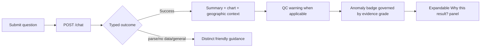

# FloatChat-Lite interface design

> Current accepted illustrative UI plus Rev. B target requirements
> Last synchronized: 21 August 2026

## Current interface

The current frontend is a local React/TypeScript/Vite demonstration using Recharts, a static Bhuvan image, and four bundled illustrative responses. It implements input/Enter submission, staged loading, success, one unsupported-query error, reset, charts, map context, a profile-count confidence gauge, status cards, and preparation text.

It does **not** call `/chat`, render suggested-query chips, distinguish typed API errors, expose QC filtering, render `evidence_grade`, or provide the expandable Rev. B “Why this result?” evidence panel. Its Low/Medium/High confidence is legacy illustrative behaviour, not the target trust judgment.

## Target user flow

## Rev. B trust presentation

| Evidence grade | Required presentation |
| --- | --- |
| `Insufficient` | Neutral “not enough data to assess”; no colored severity. Explain which condition failed. |
| `Indicative` | Show the computed result as provisional and expose limited coverage reasons. |
| `Supported` | Full visual weight is allowed only when every frozen grade condition passes. |

`data_quality_warning` is separate from the anomaly grade. It explains that records were rejected or trustworthy evidence is limited; it must not be hidden as a generic low-confidence state.

## “Why this result?” evidence panel

The expandable panel must show actual returned values, not decorative template copy:

- dataset source/version and selection dates/region/radius;
- applied QC/data-mode rule;
- raw, valid, and excluded observation/profile counts;
- distinct float count and QC pass rate;
- aggregation/current-period value;
- production baseline period, mean, standard deviation, and `n`;
- z-score and anomaly label when computed;
- evidence grade plus reasons; and
- shallow-water SST proxy caveat when relevant.

Call this computation transparency/provenance reporting. Do not market it as SHAP/LIME-style explainable AI.

## Current/target library decision

The updated architecture and PRD name Plotly.js and Leaflet, while the accepted repository uses Recharts and a static local Bhuvan image. This synchronization does not replace frontend libraries. Before implementation, the product/architecture owners must either:

1. approve migration to Plotly/Leaflet and explicitly relax the accepted-UI boundary; or
2. amend the target documents to allow the current libraries when they meet the same chart/geographic/evidence requirements.

Until that decision, documents distinguish current implementation from target intent rather than claiming either library set is complete.

## Accessibility and acceptance

Use labels, keyboard operation, text equivalents, reduced motion, and color-plus-text status cues. Formal WCAG, screen-reader, browser, narrow-screen, and projector acceptance remains unverified and must be logged.
