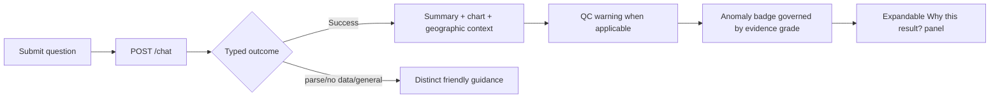

# FloatChat-Lite interface design

> Integrated Rev. B runtime interface
> Last synchronized: 22 August 2026

## Current interface

The frontend is a React/TypeScript/Vite runtime using Recharts and an interactive Leaflet/CARTO map. It calls `POST /chat`, renders suggested queries and typed errors, exposes QC/evidence state, supports Temperature/Salinity/All chart toggles, and provides an expandable “Why this result?” panel with displayed-value source traces.

## Target user flow

## Rev. B trust presentation

| Evidence grade | Required presentation |
| --- | --- |
| `Insufficient` | Neutral “not enough data to assess”; no colored severity. Explain which condition failed. |
| `Indicative` | Show the computed result as provisional and expose limited coverage reasons. |
| `Supported` | Full visual weight is allowed only when every frozen grade condition passes. |

`data_quality_warning` is separate from the anomaly grade. It explains that records were rejected or trustworthy evidence is limited; it must not be hidden as a generic low-confidence state.

## “Why this result?” evidence panel

The expandable panel must show actual returned values, not decorative template copy:

- dataset source/version and selection dates/region/radius;
- applied QC/data-mode rule;
- raw, valid, and excluded observation/profile counts;
- distinct float count and QC pass rate;
- aggregation/current-period value;
- production baseline period, mean, standard deviation, and `n`;
- z-score and anomaly label when computed;
- evidence grade plus reasons; and
- shallow-water SST proxy caveat when relevant.

Call this computation transparency/provenance reporting. Do not market it as SHAP/LIME-style explainable AI.

## Runtime library decision

The implementation keeps the established Recharts chart system and uses Leaflet for live geographic context. This avoids a chart rewrite while satisfying interactive pan/zoom, exact marker, radius, and named-region requirements.

## Accessibility and acceptance

Use labels, keyboard operation, text equivalents, reduced motion, and color-plus-text status cues. Formal WCAG, screen-reader, browser, narrow-screen, and projector acceptance remains unverified and must be logged.
